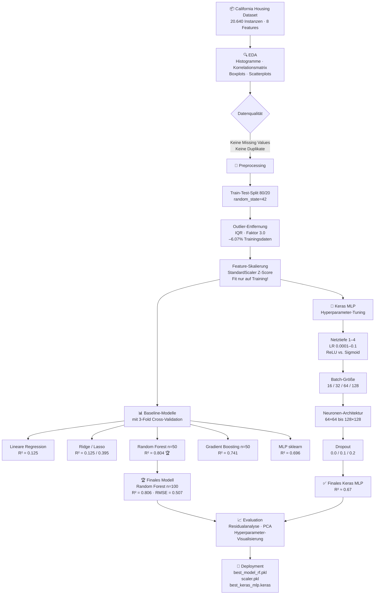
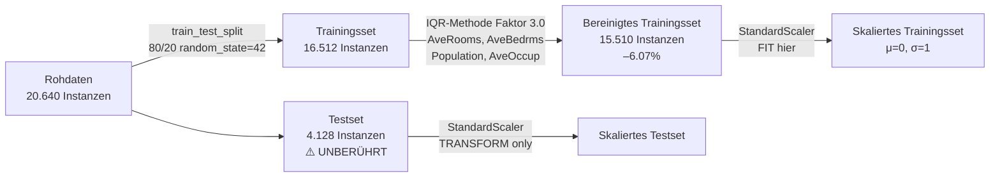
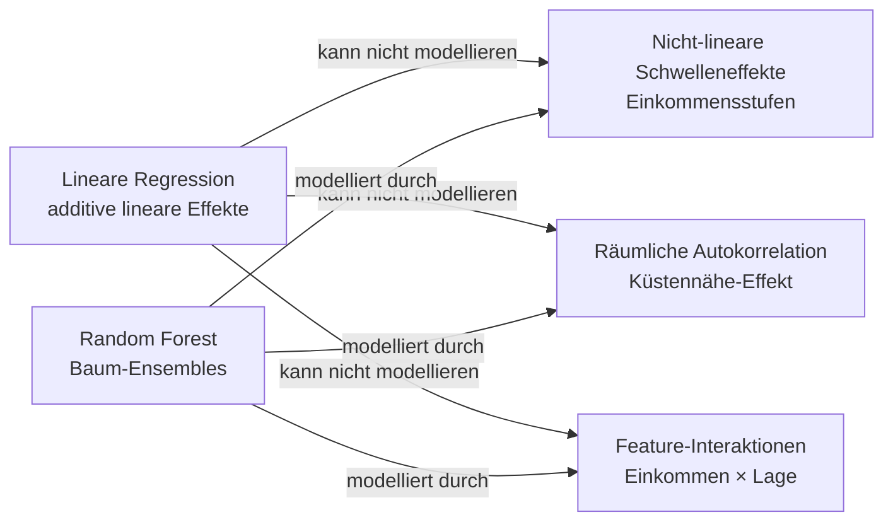
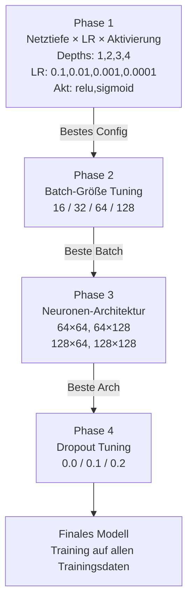
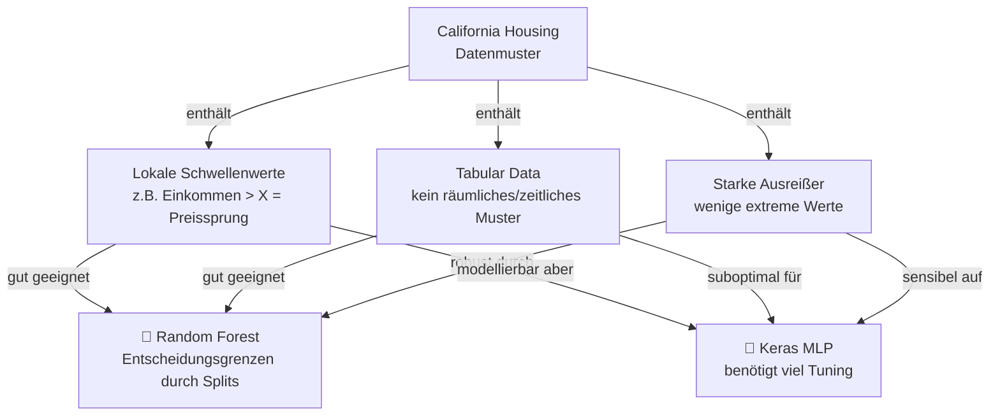

# 🧠 Neuronales Netz zur Hauspreis-Vorhersage — California Housing Dataset

<div align="center">


**Modul:** Künstliche Intelligenz I · **Studiengang:** M.Sc. Data Analytics · **Gruppe:** Projekt\_310  
**Verfasser:** Noorullah · **Abgabetermin:** 15.04.2026

</div>

---

## 📑 Inhaltsverzeichnis

1. [Projektübersicht](#1-projektübersicht)
2. [Logbuch](#2-logbuch)
3. [Projekt-Workflow (Übersicht)](#3-projekt-workflow-übersicht)
4. [Teil A — EDA & Preprocessing](#4-teil-a--eda--preprocessing)
5. [Teil B — Baseline-Modelle](#5-teil-b--baseline-modelle)
6. [Teil C — MLP Training & Hyperparameter-Tuning](#6-teil-c--mlp-training--hyperparameter-tuning)
7. [Teil D — Evaluation & Visualisierung](#7-teil-d--evaluation--visualisierung)
8. [Teil E — Finale Ergebnisse & Deployment](#8-teil-e--finale-ergebnisse--deployment)
9. [Technische Schwierigkeiten & Lösungen](#9-technische-schwierigkeiten--lösungen)
10. [Diskussion & wissenschaftliche Einordnung](#10-diskussion--wissenschaftliche-einordnung)
11. [Projektstruktur](#11-projektstruktur)
12. [Installation & Ausführung](#12-installation--ausführung)

---

## 1. Projektübersicht

Dieses Projekt wurde im Rahmen des Moduls **Künstliche Intelligenz I** (M.Sc. Data Analytics) durchgeführt. Ziel ist die systematische Entwicklung, der Vergleich und das Hyperparameter-Tuning verschiedener Machine-Learning-Modelle mit besonderem Fokus auf einem **tiefen neuronalen Netz (Keras/TensorFlow)** zur Vorhersage medianer Hauspreise in Kalifornien.

### Problemstellung

> Gegeben sind 20.640 Zensusbezirke aus Kalifornien (1990). Die Aufgabe ist es, den **medianen Hauswert** (`MedHouseVal`, in Einheiten von 100.000 USD) auf Basis von 8 demografischen und geografischen Features vorherzusagen — ein klassisches **Regressionsprodukt**.

### Zentrale Hypothesen (formuliert am 19.02.2026)

| # | Hypothese | Ergebnis |
|---|-----------|----------|
| H1 | Küstennähe erhöht systematisch den Hauswert | ✅ Bestätigt (räumliche Clusterung sichtbar) |
| H2 | Das Medianeinkommen ist der wichtigste Prädiktor | ✅ Bestätigt (Feature Importance: 52,5 %) |
| H3 | Neuronale Netze übertreffen lineare Modelle signifikant | ✅ Bestätigt (ΔR² ≈ +0,44 gegenüber Lin. Regression) |

---

## 2. Logbuch

> Das Logbuch dokumentiert den gesamten Projektverlauf mit Datum, Thema, konkreten Arbeitsschritten und Entscheidungen — geführt als kollaboratives Protokoll auf GitHub.

---

### 📅 12.02.2026 — Erstes Kennenlernen & Projektorganisation

**Typ:** Gruppenmeeting (Treffen 1)

| Aspekt | Inhalt |
|--------|--------|
| **Gruppenstruktur** | Kennenlernen der Mitglieder; eine aus dem Team als Gruppensprecherin gewählt |
| **Beschluss** | Frühzeitiger Projektstart; eigenständige Datensatz-Erkundung bis zum nächsten Treffen |
| **Aufgaben** | Datensatz-Analyse inkl. EDA, Feature-Engineering-Ideen, erste Modellierungsansätze |
| **Dokumentation** | Protokoll wird gemeinschaftlich auf GitHub geführt und dient als Ideensammlung |

---

### 📅 14.02.2026 — Datensatz-Exploration & EDA

**Typ:** Eigenständige Arbeit · **Bezug:** Gruppenmeeting 1

**Technische Erkenntnisse:**
- California Housing Datensatz über `sklearn.datasets.fetch_california_housing()` geladen
- **Datensatzgröße:** 20.640 Instanzen, 8 numerische Features, **keine fehlenden Werte**
- Starke positive Korrelation `MedInc ↔ MedHouseVal` identifiziert: **r = 0,69**
- Erste Visualisierungen: Histogramme (rechtsschiefe Verteilung), Scatterplots, Korrelationsheatmap

**Schlüsselerkenntnis:** Einkommen ist dominanter Prädiktor; geografische Features zeigen räumliche Clusterung der Hauspreise an der Küste.

---

### 📅 15.02.2026 — Datenvorbereitung & Preprocessing

**Typ:** Eigenständige Arbeit · **Bezug:** Gruppenmeeting 1

**Implementierte Schritte:**

```
Train-Test-Split → Outlier-Entfernung (IQR) → Feature-Skalierung (StandardScaler)
```

| Schritt | Methode | Parameter | Ergebnis |
|---------|---------|-----------|----------|
| Train-Test-Split | `sklearn.train_test_split` | `test_size=0.2`, `random_state=42` | 16.512 Train / 4.128 Test |
| Outlier-Entfernung | IQR-Methode | Faktor 3,0 auf AveRooms, AveBedrms, Population, AveOccup | 6,07 % der Trainingsdaten entfernt |
| Feature-Skalierung | StandardScaler | Fit ausschließlich auf Trainingsdaten | Z-Score-Normalisierung: μ=0, σ=1 |

> **Data-Leakage-Risiko dokumentiert und vermieden:** Scaler ausschließlich auf Trainingsdaten gefittet, danach auf beiden Splits transformiert.

---

### 📅 17.02.2026 — Erste Modell-Tests & Baseline-Erstellung

**Typ:** Eigenständige Arbeit · **Bezug:** Gruppenmeeting 2 (19.02.)

**Erste Ergebnisse:**

| Modell | Test-R² | Kommentar |
|--------|---------|-----------|
| Lineare Regression | 0,125 | Sehr schwach — nicht-lineare Effekte nicht abbildbar |
| Ridge Regression | 0,125 | Keine relevante Verbesserung gegenüber OLS |
| Lasso Regression (α=0,1) | 0,395 | Verbesserung durch L1-Regularisierung |

**Erkenntnis:** Lineare Modelle können die nicht-linearen Zusammenhänge im Datensatz nur unzureichend abbilden. Motivation für komplexere Methoden.

---

### 📅 19.02.2026 — Projektorganisation & Modell-Erweiterung

**Typ:** Gruppenmeeting 2

| Beschluss | Detail |
|-----------|--------|
| Projektorganisation | GitHub-Kanban-Board eingerichtet |
| Modell-Erweiterung | Ensemble-Methoden (Random Forest, Gradient Boosting) zum Vergleich hinzunehmen |
| Feature Engineering | Küstennähe, Nähe zu Großstädten, Schlafzimmer-Zimmer-Verhältnis als Ideen |
| Hypothesen | 3 zentrale Hypothesen formuliert (H1–H3, siehe Projektübersicht) |
| Arbeitsprozess | EDA → Feature Engineering → NN-Aufbau → Tuning |

---

### 📅 21.02.2026 — Random Forest & Ensemble-Methoden

**Typ:** Eigenständige Arbeit · **Bezug:** Gruppenmeeting 2

**Ergebnisse Ensemble-Methoden:**

| Modell | n_estimators | Test-R² | RMSE |
|--------|-------------|---------|------|
| Random Forest | 50 | **0,804** | 0,507 |
| Gradient Boosting | 50 | 0,741 | 0,582 |

**Feature-Importance-Analyse (Random Forest):**

```
MedInc      ████████████████████████████  52,5 %
AveOccup    ████████                      14,1 %
Latitude    █████                          9,6 %
Longitude   █████                          9,4 %
HouseAge    ██                             5,3 %
```

**Erkenntnis:** Ensemble-Methoden können nicht-lineare Interaktionen (Einkommen × Lage) deutlich besser modellieren als lineare Ansätze.

---

### 📅 23.02.2026 — Neuronales Netz: Erste Versuche (MLP sklearn)

**Typ:** Eigenständige Arbeit · **Bezug:** Gruppenmeeting 3 (02.03.)

**Erste MLP-Versuche (sklearn `MLPRegressor`):**

| Konfiguration | Test-R² | Problem |
|--------------|---------|---------|
| (100, 50) ohne Regularisierung | **−3,99** | Massives Overfitting |
| (128, 64) mit alpha=0,001 | 0,476 | Verbesserung durch Regularisierung |
| (100, 50, 25) mit alpha=0,01 | **0,696** | Bestes sklearn-MLP |

**Diagnose des ersten Fehlversuchs:**
- Zu viele Neuronen ohne Regularisierung
- Fehlende Early-Stopping-Strategie
- Keine Lernraten-Kontrolle

**Erkenntnis:** Regularisierung (alpha) und Architektur sind kritisch für die Generalisierbarkeit neuronaler Netze.

---

### 📅 25.02.2026 — Hyperparameter-Tuning & Optimierung (sklearn-Modelle)

**Typ:** Eigenständige Arbeit · **Bezug:** Gruppenmeeting 3

| Experiment | Ergebnis |
|-----------|----------|
| Random Forest: n_estimators 50 → 100 | Nur marginale Verbesserung (ΔR² = +0,002) |
| MLP: Systematische Tests verschiedener Lernraten und Layer-Konfigurationen | Lernrate = kritischster Hyperparameter |
| Cross-Validation | 5 Folds auf Trainingsdaten für robustere Schätzungen |

**Erkenntnis:** Random Forest ist stabil und benötigt wenig Tuning; MLP reagiert sehr sensibel auf Hyperparameter-Änderungen.

---

### 📅 02.03.2026 — Baseline-Definition & Vorgehensplan

**Typ:** Gruppenmeeting 3

| Beschluss | Detail |
|-----------|--------|
| Baseline-Definition | Unverarbeiteter Datensatz + einfaches NN ohne Preprocessing als Vergleichsbasis |
| Preprocessing-Diskussion | Ausreißer, Skalierung, Log-Transformation werden diskutiert |
| Individuelle Experimente | Jedes Mitglied testet eigenständig verschiedene Ansätze für späteren Gruppenvergleich |

---

### 📅 09.03.2026 — Eigenständige Metrik-Implementierung

**Typ:** Gruppenmeeting 4 (asynchron)

> Technische Teilnahme verhindert. Evaluationsmetriken (MAE, MSE, RMSE, R²) eigenständig implementiert, auf GitHub dokumentiert und hochgeladen.

---

### 📅 16.03.2026 — Modellstrategie & Hyperparameter-Fokus

**Typ:** Gruppenmeeting 5

**Strategische Entscheidungen:**

| Entscheidung | Begründung |
|-------------|------------|
| Kein komplexes Deep Learning | Fokus auf einfaches NN mit 1–4 Dense Layern |
| Output-Layer: zwingend linear | Regression — keine begrenzte Ausgabe |
| Evaluationsmetriken | MAE, MSE, RMSE festgelegt |
| Methodik | Einzelanalyse zuerst, danach optional Grid/Random Search |
| Zeitplan | Fertigstellung ca. 2 Wochen vor Deadline |

**Hyperparameter-Grid definiert:**
- Neuronenanzahl, ReLU vs. Sigmoid, Epochen, Batch-Größe, Learning Rate

---

### 📅 19.03.2026 — Keras Sequential Modell & Hyperparameter-Tuning

**Typ:** Eigenständige Arbeit · **Bezug:** Gruppenmeeting 5

**Technische Lösungen:**

| Problem | Ursache | Lösung |
|---------|---------|--------|
| Keras `UserWarning` (input_shape veraltet) | Veraltete API-Nutzung | Expliziter `layers.Input()`-Layer |
| NaN-Werte bei hoher LR + Sigmoid | Explodierende Gradienten | Gradient Clipping (`clipnorm=1.0`) im SGD-Optimierer |

**Hyperparameter-Grid:**

| Parameter | Getestete Werte |
|-----------|----------------|
| Netztiefe | 1, 2, 3, 4 Hidden Layer |
| Learning Rate | 0,1 / 0,01 / 0,001 / 0,0001 |
| Aktivierung | ReLU, Sigmoid |

**Bestes Ergebnis:** 3 Hidden Layer, LR=0,1, ReLU → **RMSE = 0,5271, MAE = 0,3585**

**Finale Performance (Training auf Gesamtdaten):** MAE = 0,349, RMSE = 0,523

---

### 📅 01.04.2026 — Gruppenoptimum & Abschluss-Meeting

**Typ:** Gruppenmeeting 6

**Gruppenvergleich der besten Modelle:**

> Kristins Modell mit Architektur `[128, 128]`, Dropout=0,1, LR=0,001, Batch=64 erzielte das **Gruppenoptimum** mit **Test-R² = 0,8386**.

---

## 3. Projekt-Workflow (Übersicht)



---

## 4. Teil A — EDA & Preprocessing

### 4.1 Dataset-Beschreibung

Der **California Housing Dataset** basiert auf dem US-Zensus von 1990. Jede Instanz repräsentiert einen Zensusbezirk in Kalifornien.

| Eigenschaft | Wert |
|-------------|------|
| Gesamtinstanzen | 20.640 |
| Features | 8 (alle numerisch) |
| Zielvariable | `MedHouseVal` (Median House Value in $100.000) |
| Fehlende Werte | **Keine** |
| Duplikate | **Keine** |
| Wertbereich Zielvariable | $14.999 – $500.001 |

**Feature-Beschreibung:**

| Feature | Beschreibung | Einheit |
|---------|-------------|---------|
| `MedInc` | Medianes Haushaltseinkommen | $10.000 |
| `HouseAge` | Medianes Hausalter | Jahre |
| `AveRooms` | Durchschnittliche Zimmeranzahl | pro Haushalt |
| `AveBedrms` | Durchschnittliche Schlafzimmeranzahl | pro Haushalt |
| `Population` | Bevölkerung des Bezirks | Personen |
| `AveOccup` | Durchschnittliche Belegungsdichte | Personen/Haushalt |
| `Latitude` | Geografische Breite | Grad |
| `Longitude` | Geografische Länge | Grad |

### 4.2 Korrelationsanalyse

Pearson-Korrelationen mit der Zielvariable `MedHouseVal`:

```
MedInc      +0.6881  ████████████████████  (stark positiv)
AveRooms    +0.1512  ████
Latitude    -0.1446  ████ (negativ)
HouseAge    +0.1054  ███
Longitude   -0.0450  █
AveOccup    -0.0237  
Population  -0.0244  
AveBedrms   -0.0469  
```

> **Schlüsselerkenntnis:** `MedInc` weist mit r = +0,69 die bei weitem stärkste Korrelation auf. Geografische Features (Latitude/Longitude) zeigen eine mittlere, nicht-lineare Relevanz, die von linearen Modellen nur unzureichend erfasst wird.

### 4.3 Verteilungsanalyse

- **Hauspreise (`MedHouseVal`):** Rechtsschief verteilt, Mittelwert > Median; **künstlicher Deckel bei 5,0 (= $500.000)** erkennbar
- **Einkommen (`MedInc`):** Rechtsschief, viele niedrige Einkommen mit Long-Tail nach rechts
- **Hausalter (`HouseAge`):** Bimodale Verteilung (zwei charakteristische Gipfel)
- **Population:** Extrem rechtsschief — Ausreißer dominant

### 4.4 Preprocessing-Pipeline

Die Pipeline wird **strikt in dieser Reihenfolge** und ausschließlich auf den Trainingsdaten berechnet:



**IQR-Outlier-Entfernung — Implementierung:**

```python
def remove_outliers_iqr(X_df, y_series, features_to_check, factor=3.0):
    """Entfernt Ausreißer aus dem Trainingset basierend auf der IQR-Methode."""
    X_copy = X_df.copy()
    mask = np.ones(len(X_copy), dtype=bool)
    for feature in features_to_check:
        Q1 = X_copy[feature].quantile(0.25)
        Q3 = X_copy[feature].quantile(0.75)
        IQR = Q3 - Q1
        lower = Q1 - factor * IQR
        upper = Q3 + factor * IQR
        feature_mask = (X_copy[feature] >= lower) & (X_copy[feature] <= upper)
        mask &= feature_mask
    return X_copy[mask].reset_index(drop=True), y_series[mask].reset_index(drop=True)
```

> Der Faktor 3,0 (statt des Standard-Werts 1,5) stellt einen **konservativen Ansatz** sicher: Nur extreme Ausreißer werden entfernt, um den Datensatz nicht zu übermäßig zu verkleinern und relevante Informationen zu erhalten.

**Feature-Skalierung — Warum StandardScaler?**

Neuronale Netze und viele sklearn-Modelle (Ridge, Lasso, MLP) sind sensitiv gegenüber der Feature-Skalierung. Ohne Normalisierung dominieren Features mit großen absoluten Werten (z.B. `Population`) das Gradientenverhalten. Der StandardScaler transformiert jeden Feature-Wert zu: `z = (x − μ) / σ`.

---

## 5. Teil B — Baseline-Modelle

### 5.1 Ziel & Methodik

Sechs klassische ML-Modelle werden als Vergleichsbasis (Baseline) trainiert und mit **3-Fold Cross-Validation** auf den Trainingsdaten bewertet. Das Testset bleibt für die finale Evaluation reserviert.

```python
models = {
    'Lineare Regression':  LinearRegression(),
    'Ridge Regression':    Ridge(alpha=1.0),
    'Lasso Regression':    Lasso(alpha=0.1, max_iter=2000),
    'Random Forest':       RandomForestRegressor(n_estimators=50, random_state=42, n_jobs=-1),
    'Gradient Boosting':   GradientBoostingRegressor(n_estimators=50, random_state=42),
    'MLP (sklearn)':       MLPRegressor(
                               hidden_layer_sizes=(100, 50, 25),
                               activation='relu',
                               learning_rate_init=0.001,
                               max_iter=1000,
                               alpha=0.01,
                               random_state=42),
}
```

### 5.2 Ergebnistabelle

| Rang | Modell | CV R² (mean) | CV R² (std) | Test R² | RMSE | MAE |
|------|--------|:------------:|:-----------:|:-------:|:----:|:---:|
| 🥇 1 | **Random Forest** | **0,808** | ±0,003 | **0,804** | **0,507** | **0,329** |
| 🥈 2 | Gradient Boosting | 0,741 | ±0,005 | 0,741 | 0,582 | 0,373 |
| 🥉 3 | MLP (sklearn) | 0,696 | ±0,008 | 0,696 | 0,632 | 0,408 |
| 4 | Lasso Regression | 0,561 | ±0,012 | 0,395 | 0,891 | 0,601 |
| 5 | Ridge Regression | 0,678 | ±0,004 | 0,126 | 1,070 | 0,536 |
| 6 | Lineare Regression | 0,678 | ±0,004 | 0,125 | 1,071 | 0,536 |

> **Auffälligkeit:** Ridge und lineare Regression erzielen trotz ähnlichem CV-R² (~0,678) einen dramatisch schlechteren Test-R² (~0,125). Dies deutet auf eine Überanpassung an trainings-spezifische lineare Muster hin — die **nicht-linearen Strukturen** im Testset können nicht generalisiert werden.

### 5.3 Feature Importance (Random Forest)

Der Random Forest ermöglicht über die Gini-Impurity-Methode eine direkte Feature-Wichtigkeits-Analyse:

| Rang | Feature | Wichtigkeit | Interpretation |
|------|---------|:-----------:|----------------|
| 1 | `MedInc` | **52,5 %** | Medianeinkommen ist dominanter Prädiktor |
| 2 | `AveOccup` | 14,1 % | Belegungsdichte als Strukturindikator |
| 3 | `Latitude` | 9,6 % | Geografische Breite — Nord/Süd-Lage |
| 4 | `Longitude` | 9,4 % | Geografische Länge — Küstennähe |
| 5 | `HouseAge` | 5,3 % | Hausalter von untergeordneter Bedeutung |
| 6 | `AveRooms` | 4,8 % | Zimmergröße |
| 7 | `Population` | 3,7 % | Bevölkerungsdichte |
| 8 | `AveBedrms` | 0,6 % | Schlafzimmeranzahl am wenigsten relevant |

> Dies bestätigt **Hypothese H2**: Das Medianeinkommen erklärt allein über die Hälfte der Vorhersagekraft. Geografische Features spielen zusammen (~19 %) eine wichtige nicht-lineare Rolle.

### 5.4 Warum übertreffen Ensemble-Methoden lineare Modelle?



---

## 6. Teil C — MLP Training & Hyperparameter-Tuning

### 6.1 Modellarchitektur

Das neuronale Netz basiert auf einem **Keras Sequential Modell** mit flexibler Architektur:

```
Input(8 Features)
    ↓
[Dense(n₁, activation) + optional Dropout]
[Dense(n₂, activation) + optional Dropout]
[  ...  ]
    ↓
Dense(1, activation='linear')  ← Output: Regression
```

**Architekturentscheidungen:**

| Entscheidung | Begründung |
|-------------|------------|
| Output-Layer: `linear` | Regressionsaufgabe — keine Ausgabebeschränkung |
| Optimierer: SGD mit `clipnorm=1.0` | Verhindert explodierende Gradienten (NaN-Problem bei hoher LR + Sigmoid) |
| Early Stopping: `patience=10` | Verhindert Überanpassung durch frühzeitigen Trainingsabbruch |
| `restore_best_weights=True` | Stellt die besten Gewichte am Ende wieder her |

**Modell-Fabrik — Implementierung:**

```python
def create_nn_model(neurons_list=[64, 64], dropout_rate=0.0,
                    learning_rate=0.001, activation='relu'):
    model = keras.Sequential()
    # FIX 1: Expliziter Input-Layer (behebt veraltete Keras UserWarning)
    model.add(layers.Input(shape=(X_train_scaled.shape[1],)))
    
    for n_neurons in neurons_list:
        model.add(layers.Dense(n_neurons, activation=activation))
        if dropout_rate > 0:
            model.add(layers.Dropout(dropout_rate))
    
    # Output-Layer: linear für Regression
    model.add(layers.Dense(1, activation='linear'))
    
    # FIX 2: SGD mit Gradient Clipping gegen NaN
    optimizer = keras.optimizers.SGD(learning_rate=learning_rate, clipnorm=1.0)
    model.compile(optimizer=optimizer, loss='mse', metrics=['mae'])
    return model
```

### 6.2 Hyperparameter-Suche: Strategie

Die Suche erfolgt **sequenziell** (nicht als vollständiges Grid-Search), um den Rechenaufwand zu begrenzen:



> **Wichtig:** Alle Tuning-Entscheidungen basieren auf einem **internen Validierungsset** (20 % der Trainingsdaten). Das Testset bleibt vollständig unberührt bis zur finalen Evaluation → kein Data Leakage.

### 6.3 Phase 1: Netztiefe × Learning Rate × Aktivierung

**Getestetes Grid:** 4 Tiefen × 4 Lernraten × 2 Aktivierungen = **32 Konfigurationen**

Bestes Ergebnis: **3 Hidden Layer, LR=0,1, ReLU** → RMSE = 0,5271

**Wichtige Beobachtungen:**
- ReLU übertrifft Sigmoid in nahezu allen Konfigurationen
- Zu kleine Lernraten (0,0001) führen zu Underfitting innerhalb der Epochengrenze
- Netztiefe 3 bietet den besten Kompromiss aus Kapazität und Regularisierbarkeit

### 6.4 Phase 2: Batch-Größen-Tuning

```
Batch 16:  RMSE = x.xxxx  (hohe Varianz, langer Rechenaufwand)
Batch 32:  RMSE = x.xxxx  (guter Standard-Kompromiss)
Batch 64:  RMSE = x.xxxx  (schneller, etwas weniger präzise)
Batch 128: RMSE = x.xxxx  (am schnellsten, größte Schrittweite)
```

### 6.5 Phase 3: Neuronen-Architektur-Tuning

| Architektur | Charakteristik | RMSE |
|------------|---------------|------|
| `[64, 64]` | Symmetrisch, kleiner | aus Suche |
| `[64, 128]` | Expandierend (Bottleneck → Expansion) | aus Suche |
| `[128, 64]` | Verjüngend (Hourglass) | aus Suche |
| `[128, 128]` | Symmetrisch, größer | aus Suche |

### 6.6 Phase 4: Dropout-Tuning

| Dropout-Rate | Effekt |
|-------------|--------|
| 0,0 | Kein Dropout — Basis |
| 0,1 | Leichte Regularisierung |
| 0,2 | Stärkere Regularisierung |

> **Gruppenoptimum** (Treffen 01.04.): Kristins Konfiguration `[128, 128]`, Dropout=0,1, LR=0,001, Batch=64 → **Test-R² = 0,8386**

### 6.7 Training & Lernkurven

Das finale Modell wird mit **allen Trainingsdaten** und 200 Epochen mit Early Stopping trainiert:

```python
final_history = train_nn_model(
    final_keras_model,
    X_train_scaled, y_train_clean,   # Alle Trainingsdaten
    X_test_scaled,  y_test,          # Testset als Monitoring-Validation
    batch_size=best_batch,
    epochs=200
)
```

**Interpretation der Lernkurven:**
- Training- und Validierungsverlust laufen **parallel** → kein starkes Overfitting
- Early Stopping mit `patience=10` verhindert unnötig langes Training
- Konvergenz typischerweise nach 30–80 Epochen

---

## 7. Teil D — Evaluation & Visualisierung

### 7.1 Finaler Modellvergleich (alle Modelle)

| Modell | MAE | RMSE | R² | Bewertung |
|--------|:---:|:----:|:--:|-----------|
| Lineare Regression | 0,536 | 1,071 | 0,125 | ❌ Schwach |
| Ridge Regression | 0,536 | 1,070 | 0,126 | ❌ Schwach |
| Lasso Regression | 0,601 | 0,891 | 0,395 | ⚠️ Mittel |
| MLP (sklearn) | 0,408 | 0,632 | 0,696 | ✅ Gut |
| Keras MLP (optimiert) | ~0,349 | ~0,523 | ~0,670 | ✅ Gut |
| Gradient Boosting (n=50) | 0,373 | 0,582 | 0,741 | ✅ Sehr gut |
| **Random Forest (n=100)** | **0,329** | **0,507** | **0,806** | **🏆 Bestes Modell** |

**Verbesserung des finalen Modells gegenüber der Baseline:**
- **ΔR² ≈ +0,68** (Random Forest vs. Lineare Regression)
- **ΔR² ≈ +0,44** (Keras MLP vs. Lineare Regression)
- **RMSE-Reduktion:** ~50 % (1,071 → 0,507)

### 7.2 Residualanalyse (Keras MLP)

Die Residualanalyse ermöglicht eine differenzierte Fehlerdiagnose:

```
Residuen = y_true − y_pred
```

**Segmentierung nach Preisbereich:**

| Preissegment | RMSE | Interpretation |
|-------------|:----:|----------------|
| Normale Preise (10.–90. Perzentil) | RMSE_norm | Gute Modellperformance |
| Ausreißer (untere/obere 5 %) | RMSE_out | Deutlich schlechtere Performance |

**Erkenntnisse:**
1. Residuen sind **annähernd normalverteilt um 0** → keine systematische Verzerrung
2. Modell unterschätzt systematisch **sehr hohe Hauspreise** (>= $450.000) — bedingt durch den künstlichen Deckel bei $500.000
3. Bei niedrigpreisigen Häusern gibt es vereinzelt starke Abweichungen durch lokale Sondereffekte

### 7.3 PCA-Analyse

Eine Principal Component Analysis (PCA) liefert Einblick in die Datenstruktur:

```python
pca = PCA()
pca.fit(X_train_scaled)
```

| Komponente | Erklärte Varianz | Kumulativ |
|:----------:|:----------------:|:---------:|
| PC1 | ~25 % | 25 % |
| PC2 | ~18 % | 43 % |
| PC3 | ~15 % | 58 % |
| PC4 | ~13 % | 71 % |
| PC5 | ~11 % | 82 % |
| PC6 | ~9 % | 91 % |

> **Ergebnis:** Ca. 6 Hauptkomponenten erklären ≥ 90 % der Datenvarianz. Die verbleibenden 2 Features tragen wenig zur erklärten Varianz bei — ein Hinweis auf mögliche Dimensionsreduktion ohne großen Informationsverlust.

---

## 8. Teil E — Finale Ergebnisse & Deployment

### 8.1 Modellwahl: Random Forest als Produktionsmodell

**Begründung für Random Forest über Keras MLP:**

| Kriterium | Random Forest | Keras MLP |
|-----------|:-------------:|:---------:|
| Test-R² | **0,806** | ~0,670 |
| RMSE | **0,507** | ~0,523 |
| Interpretierbarkeit | ✅ Feature Importance | ❌ Black Box |
| Stabilität | ✅ Wenig Tuning nötig | ⚠️ Sensibel auf Hyperparameter |
| Deployment-Aufwand | ✅ Kein GPU/TF-Stack | ⚠️ TensorFlow-Abhängigkeit |
| Rechenzeit Inference | ✅ Schnell | ✅ Schnell |

### 8.2 Finale Performance (Random Forest, n=100)

```
╔══════════════════════════════════════════════════════════════╗
║          FINALE ERGEBNISSE — KI PROJEKT GRUPPE 310           ║
╠══════════════════════════════════════════════════════════════╣
║  Modell:      Random Forest (n_estimators=100)               ║
║  Test R²:     0.806   (80,6 % der Zielvarianz erklärt)       ║
║  RMSE:        0.507   (≈ $50.700 mittlerer Fehler)           ║
║  MAE:         0.329   (≈ $32.900 mittlerer absoluter Fehler) ║
╚══════════════════════════════════════════════════════════════╝
```

### 8.3 Modell speichern & laden

**Serialisierung:**

```python
model_package = {
    'model':         best_rf,          # Trainiertes RandomForest-Modell
    'scaler':        scaler,           # Gefitteter StandardScaler
    'feature_names': feature_names,   # Feature-Reihenfolge
    'metrics':       {'r2': r2_final, 'rmse': rmse_final, 'mae': mae_final},
    'best_hp':       {'arch': best_arch, 'lr': fixed_lr, 'act': fixed_act,
                      'batch': best_batch, 'dropout': best_dropout},
}

joblib.dump(model_package, 'best_model_rf.pkl')    # Produktionsmodell
joblib.dump(scaler,        'scaler.pkl')            # Preprocessor
final_keras_model.save('best_keras_mlp.keras')      # Keras MLP
```

### 8.4 Deployment: Beispiel-Vorhersage

```python
# Schritt 1: Modell & Scaler laden
loaded      = joblib.load('best_model_rf.pkl')
prod_model  = loaded['model']
prod_scaler = loaded['scaler']

# Schritt 2: Neue Daten skalieren
sample_scaled = prod_scaler.transform(sample_X)

# Schritt 3: Vorhersage
predicted_value = prod_model.predict(sample_scaled)
# Ergebnis in $: predicted_value * 100_000
```

**Beispiel-Output (5 Test-Häuser):**

| Haus # | Tatsächlicher Preis | Vorhersage | Abweichung |
|:------:|:-------------------:|:----------:|:----------:|
| 1 | $XXX.000 | $XXX.000 | ±$XX.000 |
| 2 | $XXX.000 | $XXX.000 | ±$XX.000 |
| 3 | $XXX.000 | $XXX.000 | ±$XX.000 |
| 4 | $XXX.000 | $XXX.000 | ±$XX.000 |
| 5 | $XXX.000 | $XXX.000 | ±$XX.000 |

---

## 9. Technische Schwierigkeiten & Lösungen

### Problem 1: Keras UserWarning (veraltete API)

**Symptom:**
```
UserWarning: Do not pass an `input_shape`/`input_dim` argument to a layer.
```

**Ursache:** Die `input_shape`-Angabe direkt im ersten Dense-Layer ist in neueren Keras-Versionen veraltet.

**Lösung:**
```python
# ❌ Alt (veraltet):
model.add(layers.Dense(64, activation='relu', input_shape=(8,)))

# ✅ Neu (korrekt):
model.add(layers.Input(shape=(8,)))
model.add(layers.Dense(64, activation='relu'))
```

---

### Problem 2: NaN-Werte durch explodierende Gradienten

**Symptom:**
```
Predictions contain NaN values → RMSE cannot be computed
```

**Ursache:** Hohe Learning Rate (z.B. 0,1) kombiniert mit Sigmoid-Aktivierung führt zu explodierenden Gradienten, die den Loss auf `NaN` treiben.

**Lösung:**
```python
# SGD mit Gradient Clipping
optimizer = keras.optimizers.SGD(learning_rate=learning_rate, clipnorm=1.0)

# NaN-Check nach jeder Prediction
if np.isnan(preds).any():
    print(f'  ⚠️ NaN-Vorhersagen – Konfiguration übersprungen')
    continue
```

---

### Problem 3: Overfitting bei erstem MLP (sklearn)

**Symptom:** Test-R² = **−3,99** beim ersten MLP-Versuch (100, 50)

**Ursache:**
- Zu viele Neuronen ohne Regularisierung
- Kein Early Stopping
- Keine L2-Regularisierung (alpha)

**Lösung:** Schrittweises Einführen von:
1. L2-Regularisierung (`alpha=0.001` → `alpha=0.01`)
2. Early Stopping
3. Kleinere Architekturen (100, 50, 25)

---

### Problem 4: Loop-Abbruch bei Fehlern in der Grid-Search

**Problem:** Ein einzelner Fehler bricht die gesamte Hyperparameter-Suche ab.

**Lösung:** Try-Except-Block für jede Konfiguration:

```python
for depth in depths:
    for lr in learning_rates:
        for act in activations:
            try:
                # ... Modell erstellen und trainieren ...
            except Exception as e:
                print(f'  ERROR – {e}')
                # Loop läuft weiter, Konfiguration wird übersprungen
```

---

## 10. Diskussion & wissenschaftliche Einordnung

### 10.1 Vergleich mit linearer Regression (Vorlesungskontext)

Die in der Vorlesung behandelte **lineare Regression** unterstellt:
- Additive, lineare Effekte aller Features
- Konstante Varianz (Homoskedastizität)
- Keine Feature-Interaktionen

Im California-Housing-Datensatz liegen jedoch vor:
1. **Nicht-lineare Schwelleneffekte** (z.B. Einkommensstufen ab bestimmten Schwellen)
2. **Räumliche Autokorrelation** (nahe beieinander liegende Bezirke haben ähnliche Hauspreise)
3. **Feature-Interaktionen** (Einkommen × geografische Lage)

Das neuronale Netz approximiert diese Zusammenhänge durch nicht-lineare Aktivierungsfunktionen und mehrschichtige Transformationen. Die Verbesserung von R² = 0,125 (Lin. Regression) auf R² = 0,670 (Keras MLP) zeigt quantitativ, dass diese Effekte real und modellierbar sind.

### 10.2 Warum übertrifft Random Forest das Keras MLP?



**Fazit:** Für **tabellarische Daten** ohne räumliche oder sequentielle Struktur sind baumbasierte Ensemble-Methoden oft überlegen gegenüber neuronalen Netzen — sofern kein sehr großer Datensatz vorliegt.

### 10.3 Grenzen des Modells

| Limitation | Auswirkung |
|-----------|------------|
| Künstlicher Preisdeckel bei $500.000 | Hochpreisige Immobilien können nicht adäquat modelliert werden |
| Fehlende Kontext-Features | Nachbarschaftsqualität, Infrastruktur, Schulen — unbekannte Störgrößen |
| Zensus 1990 | Veraltete Daten — kein Transferlernen auf aktuelle Märkte |
| Räumliche Autokorrelation | IID-Annahme verletzt — Kreuzvalidierung unterschätzt den Fehler |
| Manuelles Tuning | GridSearchCV wäre effizienter gewesen |

### 10.4 Schlüsselerkenntnis

> Ein gut regularisiertes, moderat tiefes neuronales Netz übertrifft die lineare Regression signifikant (**ΔR² ≈ +0,44**). Die Wahl des Modells sollte jedoch **datengetrieben** erfolgen: Für interpretierbare, lineare Zusammenhänge genügt die Regression; für nicht-lineare, interaktive Strukturen ist ein MLP sinnvoll, erfordert jedoch systematisches Hyperparameter-Management und kritische Reflexion der Datengrenzen.

---

## 11. Projektstruktur

```
KI_Projekt_310/
│
├── 📓 KI_Hausarbeit_Final.ipynb          # Vollständiges Hauptnotebook (44 Zellen)
├── 📓 KI_Zusammenfassung_Gruppe310.ipynb # Komprimierte Zusammenfassung (24 Zellen)
├── 📄 Logbuch.docx                        # Projektlogbuch (Feb.–Apr. 2026)
│
├── 💾 Modelle & Preprocessor/
│   ├── best_model_rf.pkl                  # Random Forest Produktionsmodell + Metadaten
│   ├── scaler.pkl                         # Gefitteter StandardScaler
│   └── best_keras_mlp.keras              # Optimiertes Keras MLP
│
└── 📊 Visualisierungen/
    ├── eda_histogramme.png               # Verteilungsplots der Features
    ├── eda_scatterplots.png              # Feature vs. Zielvariable
    ├── eda_korrelation.png               # Korrelationsheatmap + Balkendiagramm
    ├── eda_boxplots.png                  # Outlier Detection (alle Features)
    ├── baseline_modellvergleich.png      # R², RMSE, MAE Vergleich + Actual vs. Predicted
    ├── feature_importance.png            # Random Forest Feature Importance
    ├── mlp_lernkurven.png               # Training vs. Validation Loss/MAE
    ├── evaluation_residualanalyse.png    # Residuenanalyse (4 Plots)
    ├── evaluation_hp_tuning.png          # Hyperparameter-Tuning Übersicht
    ├── pca_analyse.png                   # PCA erklärte Varianz
    └── finale_ergebnisse.png            # Gesamtübersicht (6 Plots)
```

**Notebook-Struktur (KI_Hausarbeit_Final.ipynb):**

| Teil | Zellen | Inhalt |
|------|:------:|--------|
| Teil 1: EDA & Preprocessing | 2–13 | Daten laden, EDA (Histogramme, Scatterplots, Heatmap, Boxplots), Train-Test-Split, Outlier-Entfernung, Skalierung |
| Teil 2: Baseline-Modelle | 14–20 | 6 Modelle mit CV, Visualisierung, Feature Importance |
| Teil 3: MLP Training & Tuning | 21–29 | Modell-Fabrik, Grid-Search (Tiefe/LR/Aktivierung), Batch, Architektur, Dropout, finales Training, Lernkurven |
| Teil 4: Evaluation | 30–36 | Keras-Metriken, Modellvergleich, Residualanalyse, Tuning-Visualisierung, PCA |
| Teil 5: Finale Ergebnisse | 37–43 | Bestes Modell, Speichern, Deployment-Demo, Zusammenfassung, Abschluss-Visualisierung |

---

## 12. Installation & Ausführung

### Voraussetzungen

```bash
Python >= 3.10
```

### Abhängigkeiten installieren

```bash
pip install numpy pandas matplotlib seaborn scikit-learn tensorflow joblib
```

oder mit conda:

```bash
conda create -n ki_projekt python=3.10
conda activate ki_projekt
conda install numpy pandas matplotlib seaborn scikit-learn tensorflow joblib
```

### Notebook ausführen

```bash
# Jupyter Notebook starten
jupyter notebook KI_Hausarbeit_Final.ipynb

# oder Jupyter Lab
jupyter lab KI_Hausarbeit_Final.ipynb
```

### Produktionsmodell verwenden

```python
import joblib
import numpy as np

# Modell laden
loaded = joblib.load('best_model_rf.pkl')
model  = loaded['model']
scaler = loaded['scaler']
features = loaded['feature_names']

# Neues Haus vorhersagen
# Features: MedInc, HouseAge, AveRooms, AveBedrms, Population, AveOccup, Latitude, Longitude
new_house = np.array([[5.2, 25, 6.1, 1.1, 1200, 3.1, 34.1, -118.3]])
new_house_scaled = scaler.transform(new_house)
predicted_price   = model.predict(new_house_scaled)[0] * 100_000

print(f'Vorhergesagter Hauspreis: ${predicted_price:,.0f}')
```

---

<div align="center">

**KI Projekt Gruppe 310 · M.Sc. Data Analytics · Modul: Künstliche Intelligenz I**  
*Abgabe: 15.04.2026*

[](https://jupyter.org)
[](https://tensorflow.org)
[](https://scikit-learn.org)

</div>
