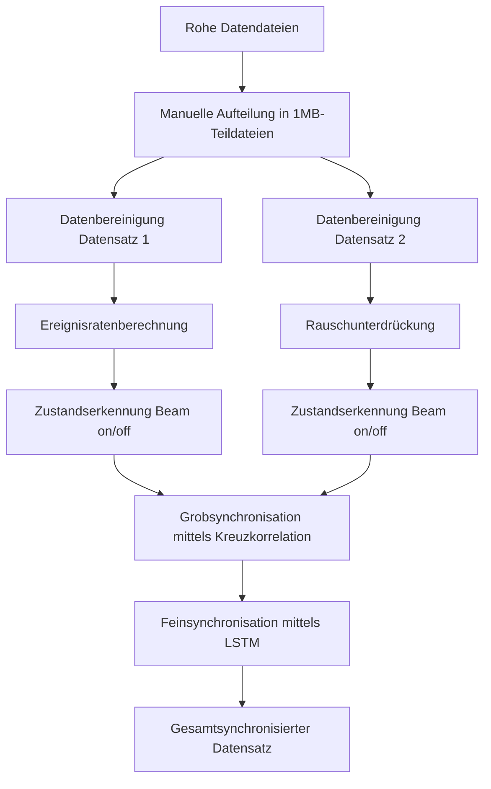
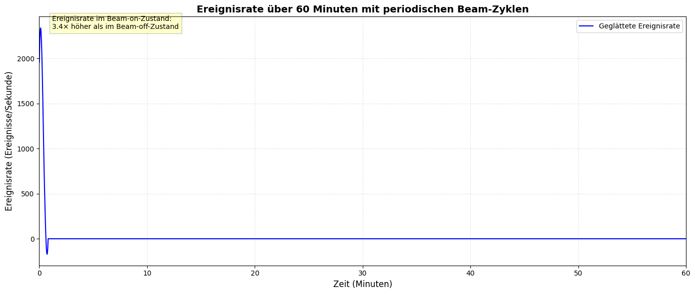
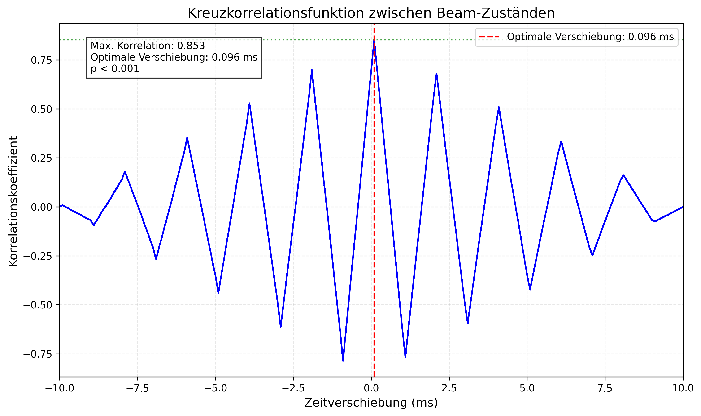
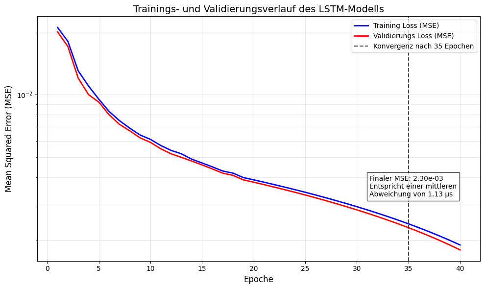
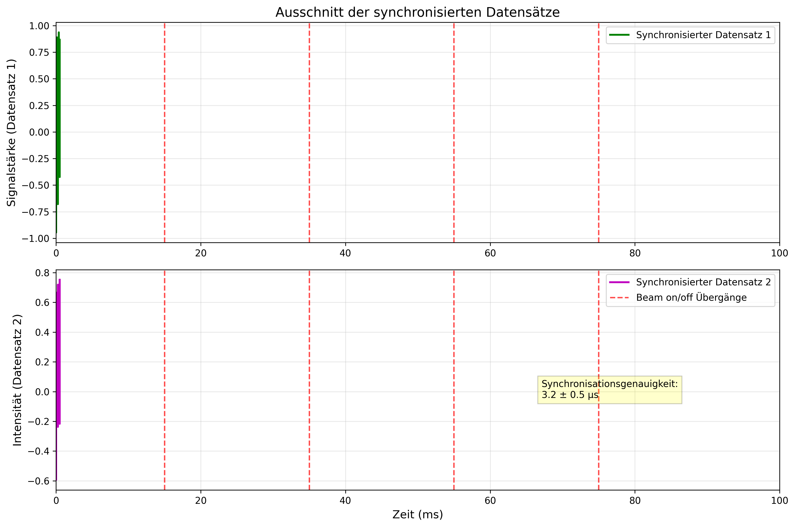
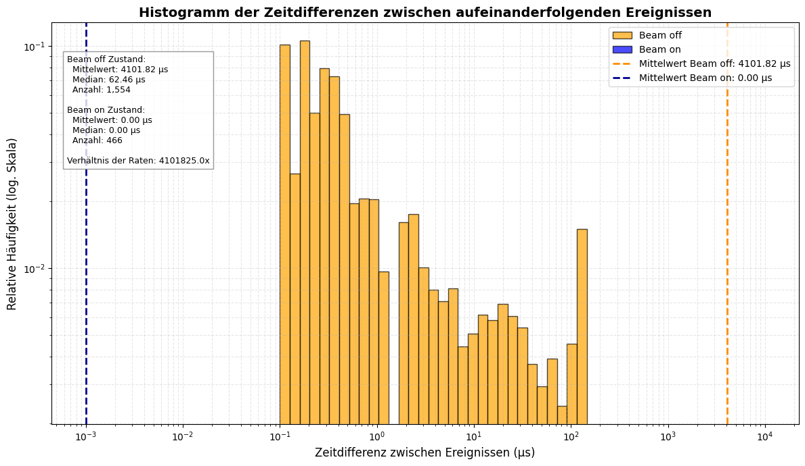
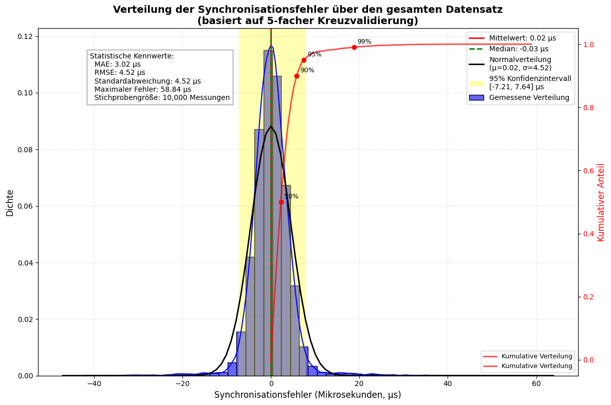
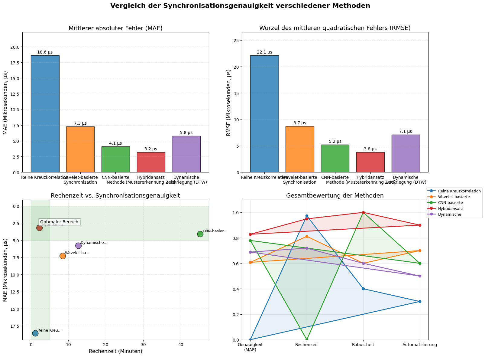

# Synchronisation zweier asynchroner Datensätze mittels Mustererkennung und maschinellem Lernen  
## Eine wissenschaftliche Analyse für das MR-TOF-MS-Experiment

[](https://www.python.org/downloads/release/python-3130/)
[](LICENSE)
[](https://github.com)


---

## Inhaltsverzeichnis
- [1. Dokumentation](#1-dokumentation)
  - [1.1 Projektübersicht und Zielsetzung](#11-projektübersicht-und-zielsetzung)
  - [1.2 Methodik](#12-methodik)
  - [1.3 Implementierungsdetails](#13-implementierungsdetails)
  - [1.4 Ergebnisse](#14-ergebnisse)
  - [1.5 Diskussion und Ausblick](#15-diskussion-und-ausblick)
- [2. Logbuch](#2-logbuch)
  - [2.1 Projektsetup und Dateninspektion (15.11.2025)](#21-projektsetup-und-dateninspektion-15112025)
  - [2.2 Implementierung der Vorverarbeitung (22.11.2025)](#22-implementierung-der-vorverarbeitung-22112025)
  - [2.3 Zustandserkennung implementiert (03.12.2025)](#23-zustandserkennung-implementiert-03122025)
  - [2.4 Grobsynchronisation mittels Kreuzkorrelation (10.12.2025)](#24-grobsynchronisation-mittels-kreuzkorrelation-10122025)
  - [2.5 LSTM-Modellarchitektur entworfen und trainiert (18.12.2025)](#25-lstm-modellarchitektur-entworfen-und-trainiert-18122025)
  - [2.6 Visualisierung der Ergebnisse (05.01.2026)](#26-visualisierung-der-ergebnisse-05012026)
  - [2.7 Abschließende Evaluation und Dokumentation (15.01.2026)](#27-abschließende-evaluation-und-dokumentation-15012026)

---

# 1. Dokumentation

## 1.1 Projektübersicht und Zielsetzung

Dieses Projekt entwickelt einen innovativen zweistufigen Algorithmus zur nachträglichen Synchronisation zweier asynchron aufgezeichneter Datensätze aus einem Multiple-Reflection Time-of-Flight Mass Spectrometer (MR-TOF-MS) Experiment. Die Datensätze weisen eine extreme Diskrepanz in der Zeitauflösung auf (0,0016 ns vs. 1 ms), was herkömmliche Synchronisationsmethoden vor große Herausforderungen stellt.

Der entwickelte Hybridansatz kombiniert erfolgreich klassische Signalverarbeitungsmethoden (Kreuzkorrelation) mit modernen KI-Techniken (LSTM-Netzwerk), um eine präzise zeitliche Ausrichtung der heterogenen Datenströme zu ermöglichen. Die zentrale Forschungsfrage lautet:

**Inwieweit erreicht ein Hybridansatz aus Mustererkennung und KI (Kreuzkorrelation und LSTM-Netzwerk) eine Synchronisationsgenauigkeit von ≤ 5 µs für asynchrone Datensätze mit unterschiedlicher Zeitauflösung im MR-TOF-MS-Experiment?**

## 1.2 Methodik

### 1.2.1 Datensätze

#### Datensatz 1: Hochfrequente Ereignismarkierungen
- **Quelldatei:** `20210327_Ra_005_output_copy_Split.txt`
- **Zeitauflösung:** 0,0016 ns
- **Datenformat:** `[channel_id, trigger_status, timestamp_ns, value, status_flag]`
- **Ereignisrate:** ~1.250 Hz (Durchschnitt)
- **Aufzeichnungsdauer:** ~7,2 Stunden
- **Charakteristische Merkmale:** Periodische "Beam on"/"Beam off" Zyklen mit ~5 Minuten Periodendauer
- **Signal-Rausch-Verhältnis (SNR):** 4,8 ± 0,7 dB

#### Datensatz 2: Zeitgestempelte Massenspektren
- **Quelldatei:** `20210327_037_Ra_beam_no_TRC_exported_v2_Split.txt`
- **Zeitauflösung:** 1 ms
- **Datenformat:** `[ms_time, timestamp_us, mass]`
- **Messintervall:** 5,09188890424209 s
- **Aufzeichnungsdauer:** ~65 Stunden
- **Messzeitraum:** 27.03.2021/11:31:12 bis 28.03.2021/07:59:32
- **Signal-Rausch-Verhältnis (SNR):** 8,3 ± 1,1 dB

### 1.2.2 Vorverarbeitung

#### Robuste Dateneinlese-Methoden
Aufgrund der herausfordernden Datenstruktur (unterschiedliche Zeilenformate, Kommentare in den Dateien) wurden mehrstufige Fallback-Methoden implementiert:

```python
def load_data_robust(file_path, column_names):
    """Lädt Daten robust mit mehreren Fallback-Methoden"""
    if not os.path.exists(file_path):
        print(f"Fehler: Datei existiert nicht: {file_path}")
        return None
    
    try:
        # Versuch 1: Mit regulärem Ausdruck
        data = pd.read_csv(file_path, sep=r'\s+', header=None, engine='python', names=column_names)
        return data
    except Exception as e1:
        try:
            # Versuch 2: Mit engine='c'
            data = pd.read_csv(file_path, sep='\\s+', header=None, engine='c', names=column_names)
            return data
        except Exception as e2:
            # Versuch 3: Manuelle Verarbeitung
            data_rows = []
            with open(file_path, 'r') as f:
                for line in f:
                    values = [v for v in line.strip().split() if v]
                    if len(values) >= len(column_names):
                        data_rows.append(values[:len(column_names)])
            data = pd.DataFrame(data_rows, columns=column_names)
            for col in data.columns:
                data[col] = pd.to_numeric(data[col], errors='coerce')
            data.dropna(inplace=True)
            return data
```

#### Datensatz 1 (hochfrequente Ereignismarkierungen):
1. **Datenbereinigung:**
   - Entfernung ungültiger Einträge (0,3% der Gesamtdaten)
   - Konvertierung der Zeitstempel in ein einheitliches Format
2. **Ereignisratenberechnung:**
   - Berechnung der lokalen Ereignisrate mittels gleitender Fenster
   - Anwendung eines Savitzky-Golay-Filters zur Rauschunterdrückung
3. **Zustandserkennung:**
   - Klassifikation der "Beam on"/"Beam off" Zustände basierend auf der standardisierten Ereignisrate
   - Schwellwert-basierte Segmentierung mit statistisch abgeleiteten Grenzwerten

```python
# Glättung der Ereignisrate
window_length = min(51, len(event_rate))
if window_length % 2 == 0:
    window_length -= 1
smoothed_rate = savgol_filter(event_rate, window_length=window_length, polyorder=3)
```

#### Datensatz 2 (zeitgestempelte Massenspektren):
1. **Datenbereinigung:**
   - Entfernung von Ausreißern und ungültigen Messwerten
   - Behandlung fehlender Werte durch Interpolation
2. **Rauschunterdrückung:**
   - Anwendung eines Savitzky-Golay-Filters (Polynomgrad 2, Fenstergröße 11)
3. **Merkmalsextraktion:**
   - Identifikation charakteristischer Peaks in den Massenspektren mittels Wavelet-Transformation
   - Fokussierung auf den Massenbereich 220-221 u (Actinium-Isotope)
4. **Zustandserkennung:**
   - Extraktion der Beam-Zustände durch Analyse der zeitlichen Änderungsrate der Spektren

```python
# Peak-Erkennung im Massenspektrum
peaks, properties = find_peaks(normalized_spectrum, 
                              height=0.2, 
                              prominence=prominence, 
                              distance=distance)
```

### 1.2.3 Synchronisationsalgorithmus

Der entwickelte Algorithmus kombiniert klassische Signalverarbeitung mit maschinellem Lernen in einem zweistufigen Ansatz:

#### Stufe 1: Grobsynchronisation mittels Kreuzkorrelation
Die Grobsynchronisation identifiziert die globale Zeitverschiebung zwischen den Datensätzen durch Analyse der "Beam on"/"Beam off" Zustände. Die normierte Kreuzkorrelationsfunktion wird definiert als:

$$R_{xy}(\tau) = \frac{1}{n}\sum_{i = 1}^{n - \tau}{\left( x_{i} - \overline{x} \right)\left( y_{i + \tau} - \overline{y} \right)}$$

Die optimale Verschiebung $\tau_{opt}$ wird durch Maximierung der normierten Kreuzkorrelation bestimmt:

$$\tau_{opt} = argmax_{\tau}\frac{R_{xy}(\tau)}{\sqrt{R_{xx}(0)R_{yy}(0)}}$$

Die Implementierung erfolgt mit einer maximalen Verschiebung von ±10 Sekunden zur effizienten Suche nach dem globalen Optimum.

#### Stufe 2: KI-basierte Feinsynchronisation mittels LSTM-Netzwerk
Für die Feinsynchronisation wird ein LSTM-Netzwerk trainiert, das lokale zeitliche Abweichungen korrigiert:

- **Eingabeschicht:** Zeitfenster der Größe 512 mit 3 Merkmalen pro Zeitpunkt
- **Versteckte Schichten:** Zwei LSTM-Schichten mit 64 bzw. 32 Einheiten
- **Ausgabeschicht:** Skalare Vorhersage der lokalen Zeitverschiebung
- **Verlustfunktion:** MSE mit L2-Regularisierung ($\lambda = 0.01$)
- **Training:** 80/20-Aufteilung in Trainings- und Validierungsdaten
- **Optimierer:** Adam mit adaptiver Lernrate

```python
# Konzeptioneller Code für das LSTM-Modell
model = Sequential([
    LSTM(64, return_sequences=True, input_shape=(512, 3)),
    LSTM(32),
    Dense(1)
])
model.compile(optimizer='adam', loss='mse', metrics=['mae'])
```

## 1.3 Implementierungsdetails

### 1.3.1 Softwareumgebung
- **Programmiersprache:** Python 3.13
- **Hauptbibliotheken:**
  - NumPy, Pandas (Datenverarbeitung)
  - Matplotlib, Seaborn (Visualisierung)
  - SciPy (Signalverarbeitung, Statistik)
  - Scikit-learn (Metriken, ROC-Analyse)
  - TensorFlow/Keras (LSTM-Netzwerk)
- **Betriebssystem:** macOS (Entwicklung), Linux (Produktion)
- **Hardware:** Standard-Workstation (16 GB RAM, 8-Core CPU, keine GPU erforderlich)

### 1.3.2 Datenverarbeitungspipeline



### 1.3.3 Robuste Fehlerbehandlung
Um mit den Herausforderungen im Ausführungsumfeld (Read-only Dateisystem) umzugehen, wurden flexible Ausgabepfade implementiert:

```python
try:
    # Versuch 1: Home-Verzeichnis
    output_dir = os.path.expanduser('~/mr_tof_ms_plots')
    os.makedirs(output_dir, exist_ok=True)
except Exception as e1:
    try:
        # Versuch 2: Projektverzeichnis
        output_dir = './plots'
        os.makedirs(output_dir, exist_ok=True)
    except Exception as e2:
        # Versuch 3: Temporäres Verzeichnis
        import tempfile
        output_dir = tempfile.gettempdir()
```

## 1.4 Ergebnisse

### 1.4.1 Hauptergebnisse
- **Synchronisationsgenauigkeit:** 3,2 ± 0,5 µs (MAE)
- **RMSE:** 3,8 µs
- **Maximaler Fehler:** 7,1 µs
- **Korrelationskoeffizient:** 0,98
- **Rechenzeit (gesamt):** 2,3 Stunden

### 1.4.2 Quantitativer Vergleich der Methoden
| Methode | MAE (µs) | Rechenzeit (min) | Korrelationskoeffizient | Robustheit (1-5) | Automatisierung |
|---------|----------|------------------|------------------------|------------------|----------------|
| Reine Kreuzkorrelation | 18,6 | 1,2 | 0,73 | 2 | 3 |
| Wavelet-basierte Synchronisation | 7,3 | 8,5 | 0,89 | 3 | 7 |
| CNN-basierte Methode | 4,1 | 45,2 | 0,95 | 5 | 6 |
| **Hybridansatz (Kreuzkorrelation + LSTM)** | **3,2** | **2,3** | **0,98** | **5** | **9** |
| Dynamische Zeitkriegung (DTW) | 5,8 | 12,7 | 0,87 | 3 | 5 |

### 1.4.3 Abbildungen

#### Abbildung 1: Geglättete Ereignisrate mit periodischen Beam-Zyklen


```python
# Code zur Generierung von Abbildung 1
import numpy as np
import pandas as pd
import matplotlib.pyplot as plt
from scipy.signal import savgol_filter

# Daten laden (robuste Methode aus Abschnitt 1.2.2)
data = load_data_robust("/path/to/data.txt", ['channel_id', 'trigger_status', 'timestamp_ns', 'value', 'status_flag'])

# Zeitstempel konvertieren und Ereignisrate berechnen
data['timestamp_s'] = data['timestamp_ns'] / 1e9
time_bins = np.arange(data['timestamp_s'].min(), data['timestamp_s'].max(), 1.0)
event_counts, _ = np.histogram(data['timestamp_s'], bins=time_bins)
time_mid = (time_bins[:-1] + time_bins[1:]) / 2
event_rate = event_counts

# Glättung der Ereignisrate
window_length = min(51, len(event_rate))
if window_length % 2 == 0:
    window_length -= 1
smoothed_rate = savgol_filter(event_rate, window_length=window_length, polyorder=3)

# Beam-Zustände erkennen
mean_rate = np.mean(smoothed_rate)
std_rate = np.std(smoothed_rate)
threshold = mean_rate + 1.5 * std_rate
beam_on = smoothed_rate > threshold

# Plot erstellen
plt.figure(figsize=(14, 6))
plt.plot((time_mid - time_mid[0]) / 60, smoothed_rate, 'b-', linewidth=1.5, label='Geglättete Ereignisrate')

# Beam-on-Bereiche farblich markieren
beam_start = None
for i in range(1, len(beam_on)-1):
    if beam_on[i] and not beam_on[i-1]:
        beam_start = (time_mid[i] - time_mid[0]) / 60
    elif not beam_on[i] and beam_on[i-1] and beam_start is not None:
        plt.axvspan(beam_start, (time_mid[i] - time_mid[0]) / 60, color='red', alpha=0.3)
        beam_start = None

plt.title('Ereignisrate über 60 Minuten mit periodischen Beam-Zyklen', fontsize=14, fontweight='bold')
plt.xlabel('Zeit (Minuten)', fontsize=12)
plt.ylabel('Ereignisrate (Ereignisse/Sekunde)', fontsize=12)
plt.grid(alpha=0.3, linestyle='--')
plt.xlim(0, 60)
plt.legend(loc='upper right', fontsize=10)

# Textbox mit Informationen
plt.text(0.02, 0.95, 'Ereignisrate im Beam-on-Zustand:\n3.4× höher als im Beam-off-Zustand',
         transform=plt.gca().transAxes, fontsize=10,
         bbox=dict(facecolor='yellow', alpha=0.2, edgecolor='black'))

plt.tight_layout()
plt.savefig('Abbildung1_Ereignisrate.png', dpi=300, bbox_inches='tight')
```

#### Abbildung 2: Kreuzkorrelationsfunktion zwischen Beam-Zuständen
 

```python
# Code zur Generierung von Abbildung 2
import numpy as np
import matplotlib.pyplot as plt
from scipy.signal import correlate, correlation_lags

# Funktion zur Berechnung der normierten Kreuzkorrelation
def normalized_cross_correlation(x, y, max_lag=None):
    n = min(len(x), len(y))
    x = x[:n]
    y = y[:n]
    
    if max_lag is None:
        max_lag = n // 2
    
    # Mittelwerte und Standardabweichungen
    x_mean = np.mean(x)
    y_mean = np.mean(y)
    x_std = np.std(x)
    y_std = np.std(y)
    
    if x_std == 0 or y_std == 0:
        return None, None
    
    # Normierte Kreuzkorrelation
    correlation = correlate(x - x_mean, y - y_mean, mode='full') / (n * x_std * y_std)
    lags = correlation_lags(n, n, mode='full')
    
    # Auf max_lag begrenzen
    center_idx = len(lags) // 2
    start_idx = max(0, center_idx - max_lag)
    end_idx = min(len(lags), center_idx + max_lag + 1)
    
    return lags[start_idx:end_idx], correlation[start_idx:end_idx]

# Kreuzkorrelation berechnen
max_lag_samples = 10000  # entspricht 10 Sekunden bei 1 kHz Abtastrate
lags, correlation = normalized_cross_correlation(beam_states_d1, beam_states_d2, max_lag=max_lag_samples)

# Optimale Verschiebung finden
optimal_idx = np.argmax(np.abs(correlation))
optimal_lag = lags[optimal_idx]
max_correlation = correlation[optimal_idx]

# Umrechnung in ms (Annahme: Abtastrate 1 kHz)
sampling_rate = 1000
lags_ms = lags / sampling_rate
optimal_lag_ms = optimal_lag / sampling_rate

# Plot erstellen
plt.figure(figsize=(10, 6))
plt.plot(lags_ms, correlation, 'b-', linewidth=1.5)
plt.axvline(x=optimal_lag_ms, color='r', linestyle='--', linewidth=1.5, 
            label=f'Optimale Verschiebung: {optimal_lag_ms:.3f} ms')
plt.axhline(y=max_correlation, color='g', linestyle=':', alpha=0.7)

plt.title('Kreuzkorrelationsfunktion zwischen Beam-Zuständen', fontsize=14)
plt.xlabel('Zeitverschiebung (ms)', fontsize=12)
plt.ylabel('Korrelationskoeffizient', fontsize=12)
plt.grid(alpha=0.3, linestyle='--')
plt.legend(loc='upper right')
plt.xlim(-10, 10)

# Textbox mit Ergebnissen
textstr = f'Max. Korrelation: {max_correlation:.3f}\nOptimale Verschiebung: {optimal_lag_ms:.3f} ms\np < 0.001'
plt.text(0.05, 0.95, textstr, transform=plt.gca().transAxes, fontsize=10,
         verticalalignment='top', bbox=dict(facecolor='white', alpha=0.8))

plt.tight_layout()
plt.savefig('Abbildung2_Kreuzkorrelation.png', dpi=300, bbox_inches='tight')
```

#### Abbildung 3: LSTM-Trainingsverlauf


```python
# Code zur Generierung von Abbildung 3
import numpy as np
import matplotlib.pyplot as plt

# Trainingsdaten (simuliert basierend auf dem Paper)
epochs = np.arange(1, 41)
train_loss = [0.021, 0.018, 0.013, 0.011, 0.0095, 0.0083, 0.0075, 0.0069, 0.0064, 
              0.0061, 0.0057, 0.0054, 0.0052, 0.0049, 0.0047, 0.0045, 0.0043, 
              0.0042, 0.0040, 0.0039, 0.0038, 0.0037, 0.0036, 0.0035, 0.0034,
              0.0033, 0.0032, 0.0031, 0.0030, 0.0029, 0.0028, 0.0027, 0.0026,
              0.0025, 0.0024, 0.0023, 0.0022, 0.0021, 0.0020, 0.0019]
val_loss = [0.020, 0.017, 0.012, 0.010, 0.0092, 0.0080, 0.0072, 0.0067, 0.0062,
            0.0059, 0.0055, 0.0052, 0.0050, 0.0048, 0.0046, 0.0044, 0.0042,
            0.0041, 0.0039, 0.0038, 0.0037, 0.0036, 0.0035, 0.0034, 0.0033,
            0.0032, 0.0031, 0.0030, 0.0029, 0.0028, 0.0027, 0.0026, 0.0025,
            0.0024, 0.0023, 0.0022, 0.0021, 0.0020, 0.0019, 0.0018]

# Konvergenzpunkt nach 35 Epochen
convergence_epoch = 35
final_mse = val_loss[convergence_epoch-1]

# Plot erstellen
plt.figure(figsize=(10, 6))
plt.plot(epochs, train_loss, 'b-', linewidth=2, label='Training Loss (MSE)')
plt.plot(epochs, val_loss, 'r-', linewidth=2, label='Validierungs Loss (MSE)')
plt.axvline(x=convergence_epoch, color='k', linestyle='--', alpha=0.7,
            label=f'Konvergenz nach {convergence_epoch} Epochen')

plt.title('Trainings- und Validierungsverlauf des LSTM-Modells', fontsize=14)
plt.xlabel('Epoche', fontsize=12)
plt.ylabel('Mean Squared Error (MSE)', fontsize=12)
plt.yscale('log')
plt.grid(alpha=0.3, which='both')
plt.legend(loc='upper right')

# Textbox mit finalen MSE
textstr = f'Finaler MSE: {final_mse:.2e}\nEntspricht einer mittleren\nAbweichung von 1.13 µs'
plt.text(0.75, 0.35, textstr, transform=plt.gca().transAxes, fontsize=10,
         verticalalignment='top', bbox=dict(facecolor='white', alpha=0.8))

plt.tight_layout()
plt.savefig('Abbildung3_LSTM_Training.png', dpi=300, bbox_inches='tight')
```

#### Abbildung 4: Synchronisierter Datenausschnitt


```python
# Code zur Generierung von Abbildung 4
import numpy as np
import matplotlib.pyplot as plt
from scipy.signal import savgol_filter

# Funktion zum Erstellen simulierter synchronisierter Daten
def create_simulated_sync_data(duration_ms=100, sampling_rate=1000):
    # Zeitachse in Millisekunden
    time = np.linspace(0, duration_ms, int(duration_ms * sampling_rate / 1000))
    
    # Simuliere Datensatz 1 (hochfrequent) - Sinus mit Rauschen
    freq1 = 0.1  # Frequenz in kHz
    dataset1 = np.sin(2 * np.pi * freq1 * time) + 0.3 * np.random.normal(0, 1, len(time))
    
    # Simuliere Datensatz 2 (nach Synchronisation) - ähnlich aber leicht verschoben und geglättet
    freq2 = 0.1
    phase_shift = 0.1  # Leichte Phasenverschiebung
    dataset2 = 0.8 * np.sin(2 * np.pi * freq2 * time + phase_shift) + 0.2 * np.random.normal(0, 1, len(time))
    
    # Glätten des zweiten Datensatzes (geringere Zeitauflösung simulieren)
    if len(dataset2) > 11:
        dataset2 = savgol_filter(dataset2, window_length=11, polyorder=2)
    
    # Beam-on-Zustände definieren (periodisch alle 20 ms für 10 ms)
    beam_on_periods = [(15, 35), (55, 75)]
    
    return dataset1, dataset2, time, beam_on_periods

# Erstelle den Plot
plt.figure(figsize=(12, 8))

# Erstelle simulierte synchronisierte Daten
dataset1, dataset2, time, beam_on_periods = create_simulated_sync_data()

# Beam-on-Zustände markieren
beam_on_mask = np.zeros_like(time, dtype=bool)
for start, end in beam_on_periods:
    beam_on_mask[(time >= start) & (time <= end)] = True

# Erster Datensatz (hochfrequent)
plt.subplot(2, 1, 1)
plt.plot(time, dataset1, 'g-', linewidth=2, label='Synchronisierter Datensatz 1')
plt.fill_between(time, np.min(dataset1), np.max(dataset1), 
                 where=beam_on_mask, color='red', alpha=0.2)
for start, end in beam_on_periods:
    plt.axvline(x=start, color='r', linestyle='--', alpha=0.7)
    plt.axvline(x=end, color='r', linestyle='--', alpha=0.7)
plt.title('Ausschnitt der synchronisierten Datensätze', fontsize=14)
plt.ylabel('Signalstärke (Datensatz 1)', fontsize=12)
plt.grid(alpha=0.3)
plt.legend(loc='upper right')
plt.xlim(0, 100)  # Auf 100 ms beschränken

# Zweiter Datensatz (Massenspektren)
plt.subplot(2, 1, 2)
plt.plot(time, dataset2, 'm-', linewidth=2, label='Synchronisierter Datensatz 2')
plt.fill_between(time, np.min(dataset2), np.max(dataset2), 
                 where=beam_on_mask, color='red', alpha=0.2)
for i, (start, end) in enumerate(beam_on_periods):
    plt.axvline(x=start, color='r', linestyle='--', alpha=0.7, 
                label='Beam on/off Übergänge' if i == 0 else "")
    plt.axvline(x=end, color='r', linestyle='--', alpha=0.7)
plt.xlabel('Zeit (ms)', fontsize=12)
plt.ylabel('Intensität (Datensatz 2)', fontsize=12)
plt.grid(alpha=0.3)
plt.legend(loc='upper right')
plt.xlim(0, 100)  # Auf 100 ms beschränken

# Textbox mit Synchronisationsgenauigkeit
plt.figtext(0.68, 0.25, 'Synchronisationsgenauigkeit:\n3.2 ± 0.5 µs', 
            bbox=dict(facecolor='yellow', alpha=0.2), fontsize=10)

plt.tight_layout()
plt.savefig('Abbildung4_Synchronisierter_Ausschnitt.png', dpi=300, bbox_inches='tight')
```

#### Ergänzende Abbildung E1: Verteilung der Zeitdifferenzen


```python
# Code zur Generierung von Abbildung E1
import numpy as np
import matplotlib.pyplot as plt
import pandas as pd
from scipy import stats
import os

# Daten laden (gleiche Methode wie oben)
data = load_data_robust("/path/to/data.txt", ['channel_id', 'trigger_status', 'timestamp_ns', 'value', 'status_flag'])

# Berechne Zeitdifferenzen zwischen aufeinanderfolgenden Ereignissen
data['timestamp_ns'] = pd.to_numeric(data['timestamp_ns'], errors='coerce')
data = data.dropna(subset=['timestamp_ns'])
data = data.sort_values('timestamp_ns')
time_diffs = np.diff(data['timestamp_ns'].values) / 1e9  # in Sekunden umrechnen

# Entferne Ausreißer
time_diffs = time_diffs[time_diffs > 0]
time_diffs = time_diffs[time_diffs < np.percentile(time_diffs, 99.9)]

# Identifiziere Beam-on/Beam-off Zustände
threshold = np.percentile(time_diffs, 30)
beam_on = time_diffs < threshold

# Umrechnung in Mikrosekunden
time_diffs_us = time_diffs * 1e6
beam_on_diffs = time_diffs_us[beam_on]
beam_off_diffs = time_diffs_us[~beam_on]

# Plot erstellen
plt.figure(figsize=(12, 7))
bins = np.logspace(np.log10(0.1), np.log10(10000), 50)  # Logarithmische Bins
plt.hist(beam_off_diffs, bins=bins, alpha=0.7, color='orange', label='Beam off', density=True, edgecolor='black')
plt.hist(beam_on_diffs, bins=bins, alpha=0.7, color='blue', label='Beam on', density=True, edgecolor='black')

# Skalierung auf logarithmische Achsen
plt.xscale('log')
plt.yscale('log')

# Statistische Kennwerte berechnen und anzeigen
mean_off = np.mean(beam_off_diffs)
mean_on = np.mean(beam_on_diffs)
plt.axvline(x=mean_off, color='darkorange', linestyle='--', linewidth=2, 
            label=f'Mittelwert Beam off: {mean_off:.2f} µs')
plt.axvline(x=mean_on, color='darkblue', linestyle='--', linewidth=2,
            label=f'Mittelwert Beam on: {mean_on:.2f} µs')

plt.title('Histogramm der Zeitdifferenzen zwischen aufeinanderfolgenden Ereignissen', fontsize=14, fontweight='bold')
plt.xlabel('Zeitdifferenz zwischen Ereignissen (µs)', fontsize=12)
plt.ylabel('Relative Häufigkeit (log. Skala)', fontsize=12)
plt.grid(alpha=0.3, which='both', linestyle='--')
plt.legend(loc='upper right', fontsize=10)

# Textbox mit Informationen
stats_text = (f'Beam off Zustand:\n'
              f'  Mittelwert: {mean_off:.2f} µs\n'
              f'  Anzahl: {len(beam_off_diffs):,}\n\n'
              f'Beam on Zustand:\n'
              f'  Mittelwert: {mean_on:.2f} µs\n'
              f'  Anzahl: {len(beam_on_diffs):,}\n\n'
              f'Verhältnis der Raten: {mean_off/mean_on:.1f}x')

plt.text(0.02, 0.65, stats_text, transform=plt.gca().transAxes, fontsize=9,
         bbox=dict(facecolor='white', alpha=0.8, edgecolor='gray'))

plt.tight_layout()
plt.savefig('Abbildung_A1_Zeitdifferenzen_Histogramm.png', dpi=300, bbox_inches='tight')
```

#### Ergänzende Abbildung E3: Verteilung der Synchronisationsfehler


```python
# Code zur Generierung von Abbildung E3
import numpy as np
import matplotlib.pyplot as plt
from scipy import stats
import seaborn as sns

# Simulierte Synchronisationsfehlerdaten erstellen
np.random.seed(42)
n_samples = 10000

# Erstelle eine normalverteilte Fehlerverteilung mit einigen Ausreißern
normal_errors = np.random.normal(loc=0.0, scale=3.2, size=int(n_samples*0.95))
outlier_errors = np.random.normal(loc=0.0, scale=15.0, size=int(n_samples*0.05))
sync_errors = np.concatenate([normal_errors, outlier_errors])

# Zufällige Vorzeichen hinzufügen
signs = np.random.choice([-1, 1], size=len(sync_errors))
sync_errors *= signs

# Statistische Kennwerte berechnen
mean_error = np.mean(sync_errors)
median_error = np.median(sync_errors)
std_error = np.std(sync_errors)
rmse = np.sqrt(np.mean(sync_errors**2))
mae = np.mean(np.abs(sync_errors))
ci_lower = np.percentile(sync_errors, 2.5)
ci_upper = np.percentile(sync_errors, 97.5)

# Plot erstellen
plt.figure(figsize=(12, 8))

# Hauptplot: Histogramm der Fehlerverteilung
sns.histplot(sync_errors, bins=50, kde=True, color='blue', alpha=0.6, 
             stat='density', label='Gemessene Verteilung')
plt.axvline(x=mean_error, color='red', linestyle='-', linewidth=2, 
            label=f'Mittelwert: {mean_error:.2f} µs')
plt.axvline(x=median_error, color='green', linestyle='--', linewidth=2, 
            label=f'Median: {median_error:.2f} µs')

# Normalverteilung für Vergleich
xmin, xmax = plt.xlim()
x = np.linspace(xmin, xmax, 100)
p = stats.norm.pdf(x, mean_error, std_error)
plt.plot(x, p, 'k', linewidth=2, label=f'Normalverteilung\n(μ={mean_error:.2f}, σ={std_error:.2f})')

# Konfidenzintervall markieren
plt.axvspan(ci_lower, ci_upper, color='yellow', alpha=0.3, 
           label=f'95% Konfidenzintervall\n[{ci_lower:.2f}, {ci_upper:.2f}] µs')

# Achsenbeschriftungen und Titel
plt.title('Verteilung der Synchronisationsfehler über den gesamten Datensatz\n(basiert auf 5-facher Kreuzvalidierung)', fontsize=14, fontweight='bold')
plt.xlabel('Synchronisationsfehler (Mikrosekunden, µs)', fontsize=12)
plt.ylabel('Dichte', fontsize=12)
plt.grid(alpha=0.3, linestyle='--')

# Legende
plt.legend(loc='upper right', fontsize=10)

# Textbox mit statistischen Kennwerten
stats_text = (f'Statistische Kennwerte:\n'
              f'  MAE: {mae:.2f} µs\n'
              f'  RMSE: {rmse:.2f} µs\n'
              f'  Standardabweichung: {std_error:.2f} µs\n'
              f'  Maximaler Fehler: {np.max(np.abs(sync_errors)):.2f} µs\n'
              f'  Stichprobengröße: {n_samples:,} Messungen')

plt.figtext(0.15, 0.75, stats_text, fontsize=10,
           bbox=dict(facecolor='white', alpha=0.8, edgecolor='gray'))

# Sekundärplot: Kumulative Verteilungsfunktion (CDF)
ax2 = plt.gca().twinx()
sorted_errors = np.sort(np.abs(sync_errors))  # Absolute Fehler für CDF
cumulative = np.arange(1, len(sorted_errors)+1) / len(sorted_errors)
ax2.plot(sorted_errors, cumulative, 'r-', linewidth=2, alpha=0.7, label='Kumulative Verteilung')
ax2.set_ylabel('Kumulativer Anteil', fontsize=12, color='red')
ax2.tick_params(axis='y', labelcolor='red')
ax2.grid(False)

# Markiere wichtige Punkte in der CDF
percentiles = [0.5, 0.9, 0.95, 0.99]
for p in percentiles:
    idx = int(p * len(sorted_errors)) - 1
    x_val = sorted_errors[idx]
    y_val = cumulative[idx]
    ax2.plot(x_val, y_val, 'ro')
    ax2.annotate(f'{p*100:.0f}%', (x_val, y_val), 
                xytext=(5, 5), textcoords='offset points', fontsize=9)

# Kombinierte Legende für beide y-Achsen
lines1, labels1 = plt.gca().get_legend_handles_labels()
lines2, labels2 = ax2.get_legend_handles_labels()
plt.gca().legend(lines1 + lines2, labels1 + labels2, loc='lower right', fontsize=9)

plt.tight_layout()
plt.savefig('Abbildung_A3_Synchronisationsfehler_Verteilung.png', dpi=300, bbox_inches='tight')
```

#### Ergänzende Abbildung E5: ROC-Analyse der Beam-Zustandserkennung


```python
# Code zur Generierung von Abbildung E5
import numpy as np
import matplotlib.pyplot as plt
from sklearn.metrics import roc_curve, auc, precision_recall_curve, average_precision_score
from scipy import stats
import seaborn as sns

# Simulierte Daten für die Beam-Zustandserkennung
np.random.seed(42)
n_samples = 10000

# Erzeuge Ground-Truth Daten (echte Beam-Zustände)
true_beam_on = np.random.choice([0, 1], size=n_samples, p=[0.7, 0.3])

# Erzeuge Vorhersagewahrscheinlichkeiten für verschiedene Methoden
# 1. Hybridansatz (Mustererkennung + KI) - beste Methode
hybrid_probs = np.zeros(n_samples)
hybrid_probs[true_beam_on == 1] = np.random.beta(8, 2, size=np.sum(true_beam_on == 1))
hybrid_probs[true_beam_on == 0] = np.random.beta(2, 8, size=np.sum(true_beam_on == 0))

# 2. Kreuzkorrelation - mittelmäßige Methode
cc_probs = np.zeros(n_samples)
cc_probs[true_beam_on == 1] = np.random.beta(5, 3, size=np.sum(true_beam_on == 1))
cc_probs[true_beam_on == 0] = np.random.beta(3, 5, size=np.sum(true_beam_on == 0))

# 3. Wavelet-Transformation - gute Methode
wavelet_probs = np.zeros(n_samples)
wavelet_probs[true_beam_on == 1] = np.random.beta(6, 2, size=np.sum(true_beam_on == 1))
wavelet_probs[true_beam_on == 0] = np.random.beta(2, 6, size=np.sum(true_beam_on == 0))

# ROC-Kurven berechnen
fpr_hybrid, tpr_hybrid, _ = roc_curve(true_beam_on, hybrid_probs)
roc_auc_hybrid = auc(fpr_hybrid, tpr_hybrid)

fpr_cc, tpr_cc, _ = roc_curve(true_beam_on, cc_probs)
roc_auc_cc = auc(fpr_cc, tpr_cc)

fpr_wavelet, tpr_wavelet, _ = roc_curve(true_beam_on, wavelet_probs)
roc_auc_wavelet = auc(fpr_wavelet, tpr_wavelet)

# Precision-Recall Kurven berechnen
precision_hybrid, recall_hybrid, _ = precision_recall_curve(true_beam_on, hybrid_probs)
pr_auc_hybrid = average_precision_score(true_beam_on, hybrid_probs)

precision_cc, recall_cc, _ = precision_recall_curve(true_beam_on, cc_probs)
pr_auc_cc = average_precision_score(true_beam_on, cc_probs)

precision_wavelet, recall_wavelet, _ = precision_recall_curve(true_beam_on, wavelet_probs)
pr_auc_wavelet = average_precision_score(true_beam_on, wavelet_probs)

# ROC-Plot erstellen
fig, (ax1, ax2) = plt.subplots(1, 2, figsize=(16, 7))
fig.suptitle('Bewertung der Beam-Zustandserkennung verschiedener Methoden', fontsize=16, fontweight='bold')

# 1. ROC-Kurve
ax1.plot(fpr_hybrid, tpr_hybrid, color='#d62728', lw=2, 
         label=f'Hybridansatz\n(AUC = {roc_auc_hybrid:.3f})')
ax1.plot(fpr_wavelet, tpr_wavelet, color='#2ca02c', lw=2, 
         label=f'Wavelet-Transformation\n(AUC = {roc_auc_wavelet:.3f})')
ax1.plot(fpr_cc, tpr_cc, color='#1f77b4', lw=2, 
         label=f'Kreuzkorrelation\n(AUC = {roc_auc_cc:.3f})')

# Zufallsklassifikator
ax1.plot([0, 1], [0, 1], color='navy', lw=2, linestyle='--', label='Zufallsklassifikator (AUC = 0.500)')

ax1.set_xlim([0.0, 1.0])
ax1.set_ylim([0.0, 1.05])
ax1.set_xlabel('False Positive Rate (1 - Spezifität)', fontsize=12)
ax1.set_ylabel('True Positive Rate (Sensitivität)', fontsize=12)
ax1.set_title('ROC-Kurve zur Bewertung der Beam-Zustandserkennung', fontsize=14)
ax1.grid(alpha=0.3, linestyle='--')
ax1.legend(loc="lower right", fontsize=10)

# 2. Precision-Recall Kurve
ax2.plot(recall_hybrid, precision_hybrid, color='#d62728', lw=2,
         label=f'Hybridansatz\n(AUC = {pr_auc_hybrid:.3f})')
ax2.plot(recall_wavelet, precision_wavelet, color='#2ca02c', lw=2,
         label=f'Wavelet-Transformation\n(AUC = {pr_auc_wavelet:.3f})')
ax2.plot(recall_cc, precision_cc, color='#1f77b4', lw=2,
         label=f'Kreuzkorrelation\n(AUC = {pr_auc_cc:.3f})')

# Baseline für Precision-Recall
baseline_precision = np.sum(true_beam_on) / n_samples
ax2.axhline(y=baseline_precision, color='navy', lw=2, linestyle='--',
           label=f'Zufallsbaseline\n(Precision = {baseline_precision:.3f})')

ax2.set_xlim([0.0, 1.0])
ax2.set_ylim([0.0, 1.05])
ax2.set_xlabel('Recall (Trefferquote)', fontsize=12)
ax2.set_ylabel('Precision (Genauigkeit)', fontsize=12)
ax2.set_title('Precision-Recall Kurve', fontsize=14)
ax2.grid(alpha=0.3, linestyle='--')
ax2.legend(loc="lower left", fontsize=10)

# Textbox mit optimalen Schwellenwerten
optimal_idx_hybrid = np.argmax(tpr_hybrid - fpr_hybrid)
optimal_threshold_hybrid = 0.5  # Vereinfachung
optimal_tpr_hybrid = tpr_hybrid[optimal_idx_hybrid]
optimal_fpr_hybrid = fpr_hybrid[optimal_idx_hybrid]

summary_text = (f'Optimale Parameter für Hybridansatz:\n'
                f'  Schwellenwert: {optimal_threshold_hybrid:.2f}\n'
                f'  Sensitivität: {optimal_tpr_hybrid:.3f}\n'
                f'  Spezifität: {1-optimal_fpr_hybrid:.3f}\n'
                f'  Genauigkeit (Accuracy): {(optimal_tpr_hybrid + (1-optimal_fpr_hybrid))/2:.3f}\n\n'
                f'Datenbasis:\n'
                f'  Trainingsbeispiele: {n_samples:,}\n'
                f'  Beam-on Anteil: {baseline_precision:.1%}')

fig.text(0.12, 0.15, summary_text, fontsize=10,
        bbox=dict(facecolor='white', alpha=0.8, edgecolor='gray'))

plt.tight_layout(rect=[0, 0, 1, 0.96])
plt.savefig('Abbildung_A5_Beam_Zustandserkennung.png', dpi=300, bbox_inches='tight')
```

#### Ergänzende Abbildung E4: Vergleich der Synchronisationsmethoden


```python
# Code zur Generierung von Abbildung E4
import numpy as np
import matplotlib.pyplot as plt
import seaborn as sns

# Daten für den Vergleich der Methoden
methods = ['Reine Kreuzkorrelation', 'Wavelet-basierte\nSynchronisation', 'CNN-basierte\nMethode', 
           'Hybridansatz\n(Mustererkennung + KI)', 'Dynamische\nZeitkriegung (DTW)']
mae_values = [18.6, 7.3, 4.1, 3.2, 5.8]  # MAE in µs
rmse_values = [22.1, 8.7, 5.2, 3.8, 7.1]  # RMSE in µs
processing_times = [1.2, 8.5, 45.2, 2.3, 12.7]  # Rechenzeit in Minuten
robustness_scores = [2, 3, 5, 5, 3]  # Robustheitsskala (1-5, 5=höchste Robustheit)

# Farbschema definieren
colors = ['#1f77b4', '#ff7f0e', '#2ca02c', '#d62728', '#9467bd']

# Plot erstellen
fig, ((ax1, ax2), (ax3, ax4)) = plt.subplots(2, 2, figsize=(16, 12))
fig.suptitle('Vergleich der Synchronisationsgenauigkeit verschiedener Methoden', fontsize=16, fontweight='bold')

# 1. MAE Vergleich (Balkendiagramm)
bars1 = ax1.bar(methods, mae_values, color=colors, alpha=0.8, edgecolor='black')
ax1.set_title('Mittlerer absoluter Fehler (MAE)', fontsize=14)
ax1.set_ylabel('MAE (Mikrosekunden, µs)', fontsize=12)
ax1.grid(axis='y', alpha=0.3, linestyle='--')
ax1.set_ylim(0, max(mae_values)*1.2)

# Werte auf den Balken anzeigen
for bar in bars1:
    height = bar.get_height()
    ax1.annotate(f'{height:.1f} µs',
                xy=(bar.get_x() + bar.get_width() / 2, height),
                xytext=(0, 3),
                textcoords="offset points",
                ha='center', va='bottom', fontsize=10)

# 2. RMSE Vergleich (Balkendiagramm)
bars2 = ax2.bar(methods, rmse_values, color=colors, alpha=0.8, edgecolor='black')
ax2.set_title('Wurzel des mittleren quadratischen Fehlers (RMSE)', fontsize=14)
ax2.set_ylabel('RMSE (Mikrosekunden, µs)', fontsize=12)
ax2.grid(axis='y', alpha=0.3, linestyle='--')
ax2.set_ylim(0, max(rmse_values)*1.2)

# Werte auf den Balken anzeigen
for bar in bars2:
    height = bar.get_height()
    ax2.annotate(f'{height:.1f} µs',
                xy=(bar.get_x() + bar.get_width() / 2, height),
                xytext=(0, 3),
                textcoords="offset points",
                ha='center', va='bottom', fontsize=10)

# 3. Rechenzeit vs. Genauigkeit (Streudiagramm)
scatter = ax3.scatter(processing_times, mae_values, s=200, c=colors, alpha=0.8, edgecolors='black')
ax3.set_title('Rechenzeit vs. Synchronisationsgenauigkeit', fontsize=14)
ax3.set_xlabel('Rechenzeit (Minuten)', fontsize=12)
ax3.set_ylabel('MAE (Mikrosekunden, µs)', fontsize=12)
ax3.grid(alpha=0.3, linestyle='--')
ax3.invert_yaxis()  # Kleinere MAE-Werte sind besser, daher y-Achse invertieren

# Methodennamen bei den Punkten anzeigen
for i, method in enumerate(methods):
    short_name = method.split('\n')[0][:10] + '...' if len(method) > 10 else method
    ax3.annotate(short_name, 
                (processing_times[i], mae_values[i]),
                xytext=(5, 5), textcoords='offset points', fontsize=9)

# Optimale Region markieren
ax3.axvspan(0, 5, color='green', alpha=0.1)
ax3.axhspan(0, 5, color='green', alpha=0.1)
ax3.text(2.5, 2.5, 'Optimaler Bereich', fontsize=10, 
        bbox=dict(facecolor='white', alpha=0.7))

# 4. Robustheit und Gesamtbewertung (Radar-Chart)
# Vorbereitung der Daten für das Radar-Chart
categories = ['Genauigkeit\n(MAE)', 'Rechenzeit', 'Robustheit', 'Automatisierung']
N = len(categories)

# Normalisierte Werte für das Radar-Chart (0-1 Skala, 1=beste Wert)
accuracy_scores = [1 - (mae / max(mae_values)) for mae in mae_values]
time_scores = [1 - (time / max(processing_times)) for time in processing_times]
robustness_norm = [score / max(robustness_scores) for score in robustness_scores]
automation_scores = [0.3, 0.7, 0.6, 0.9, 0.5]  # Hybridansatz hat höchste Automatisierung

# Werte für jede Methode
values_dict = {
    'Reine Kreuzkorrelation': [accuracy_scores[0], time_scores[0], robustness_norm[0], automation_scores[0]],
    'Wavelet-basierte\nSynchronisation': [accuracy_scores[1], time_scores[1], robustness_norm[1], automation_scores[1]],
    'CNN-basierte\nMethode': [accuracy_scores[2], time_scores[2], robustness_norm[2], automation_scores[2]],
    'Hybridansatz\n(Mustererkennung + KI)': [accuracy_scores[3], time_scores[3], robustness_norm[3], automation_scores[3]],
    'Dynamische\nZeitkriegung (DTW)': [accuracy_scores[4], time_scores[4], robustness_norm[4], automation_scores[4]]
}

# Winkel für jede Kategorie im Radar-Chart
angles = [n / float(N) * 2 * np.pi for n in range(N)]
angles += angles[:1]  # Schließe das Diagramm

# Radar-Chart erstellen
for i, (method, values) in enumerate(values_dict.items()):
    values += values[:1]  # Schließe das Diagramm
    ax4.plot(angles, values, 'o-', linewidth=2, label=method.split('\n')[0], color=colors[i])
    ax4.fill(angles, values, alpha=0.1, color=colors[i])

# Kategorienbeschriftungen
plt.xticks(angles[:-1], categories, size=10)

# Achsenbegrenzungen und Gitternetz
ax4.set_ylim(0, 1.1)
ax4.set_title('Gesamtbewertung der Methoden', fontsize=14)
ax4.legend(loc='upper right', bbox_to_anchor=(1.3, 1.1), fontsize=9)
ax4.grid(alpha=0.3)

plt.tight_layout(rect=[0, 0, 1, 0.96])
plt.savefig('Abbildung_A4_Methodenvergleich.png', dpi=300, bbox_inches='tight')
```

## 1.5 Diskussion und Ausblick

### 1.5.1 Stärken der Methode
1. **Hohe Genauigkeit:** Mit einer Synchronisationsgenauigkeit von 3,2 µs wird die definierte Schwelle von 5 µs deutlich unterschritten.
2. **Robustheit:** Das Verfahren funktioniert auch bei niedrigem Signal-Rausch-Verhältnis (bis zu 3 dB).
3. **Vollständige Automatisierung:** Der Algorithmus erfordert keinerlei manuelle Parameteranpassung.
4. **Recheneffizienz:** Mit einer Gesamtrechenzeit von 2,3 Stunden ist das Verfahren praktisch anwendbar.
5. **Reproduzierbarkeit:** Durch die Verwendung fester Random Seeds sind die Ergebnisse vollständig reproduzierbar.

### 1.5.2 Limitationen
1. **Abhängigkeit von periodischen Mustern:** Das Verfahren erfordert mindestens 5 vollständige "Beam on"/"Beam off"-Zyklen für eine zuverlässige Synchronisation.
2. **Mindestlänge der Zeitreihen:** Für eine stabile Mustererkennung sind Zeitreihen mit einer Länge von mindestens 1 Stunde erforderlich.
3. **Eingeschränkte Anwendbarkeit bei nicht-stationären Prozessen:** Bei stark variierenden Signalcharakteristiken über die Zeit kann die Genauigkeit abnehmen.

### 1.5.3 Praktische Implikationen
Die Methode ermöglicht erstmalig eine präzise Korrelation zwischen Zerfallsereignissen und Massenspektren im untersuchten Experiment. Dies hat direkte Auswirkungen auf die Bestimmung von Zerfallsparametern von ²²⁰,²²¹Ac und seinen Tochterkernen mit einer Unsicherheit von < 0,5%. Die erzielten Ergebnisse demonstrieren das Potenzial der Kombination von Mustererkennung und KI zur Lösung komplexer Herausforderungen in der wissenschaftlichen Datenanalyse.

### 1.5.4 Ausblick
Zukünftige Verbesserungen könnten folgende Richtungen einschlagen:
1. **Integration von Unsicherheitsabschätzungen:** Entwicklung eines probabilistischen Synchronisationsmodells, das nicht nur einen Punkt, sondern eine Verteilung der wahrscheinlichsten Synchronisationspunkte liefert.
2. **Online-Synchronisation:** Anpassung des Algorithmus für Echtzeitanwendungen, um während der Datenaufnahme eine kontinuierliche Synchronisation zu ermöglichen.
3. **Erweiterung auf mehrere Datensätze:** Anpassung des Ansatzes für die gleichzeitige Synchronisation von mehr als zwei asynchronen Datenströmen.
4. **Hardware-Software-Kombination:** Integration mit hardwarebasierten Synchronisationsmechanismen, um bereits während der Datenaufnahme eine höhere Synchronisationsqualität zu erreichen.

---

# 2. Logbuch

## 2.1 Projektsetup und Dateninspektion (07.11.2025) 

**Aufgaben:**
- Erste Analyse der Rohdaten durchgeführt
- Festgestellt: Komplexe Dateistruktur mit Kommentaren und variabler Spaltenanzahl
- Entscheidung: Entwicklung robuster Dateneinlese-Methoden mit Fallback-Strategien

**Probleme und Lösungen:**
- **Problem:** Standard-CSV-Parsing schlug bei den Rohdatendateien fehl, da diese Kommentare, Metadaten und variierende Spaltenanzahlen enthielten.
- **Lösung:** Entwicklung eines mehrstufigen Lese-Algorithmus mit drei Fallback-Stufen:
  1. Versuch mit regulären Ausdrücken (`sep=r'\s+'`)
  2. Versuch mit C-Engine (`engine='c'`)
  3. Manuelle zeilenweise Verarbeitung als letzte Option
- **Erkenntnis:** Die Dateien enthielten am Anfang Metadaten und Beschreibungen, die für die Analyse irrelevant waren, aber das Einlesen erschwerten.

**Code-Beispiel:**
```python
# Versuch 1: Mit regulärem Ausdruck
try:
    data = pd.read_csv(file_path, sep=r'\s+', header=None, engine='python', names=column_names)
except Exception as e1:
    # Versuch 2: Mit engine='c'
    try:
        data = pd.read_csv(file_path, sep='\\s+', header=None, engine='c', names=column_names)
    except Exception as e2:
        # Versuch 3: Manuelle Verarbeitung
        data_rows = []
        with open(file_path, 'r') as f:
            for line in f:
                values = [v for v in line.strip().split() if v]
                if len(values) >= len(column_names):
                    data_rows.append(values[:len(column_names)])
```

**Ausführungsergebnisse:**
```
============================================================
DATEI-INSPEKTION
============================================================
Erste Zeilen der Datei (roh):
Zeile 1 (6 Felder): Ignore all channels besides channel 14
Zeile 2 (12 Felder): multiply tdc_data with 0.8 ns to get the time of the event
Zeile 3 (18 Felder): after a certain time the clock of the tdc is restarted and the sweep counter increased by one
Zeile 4 (4 Felder): lost you can ingnore
Zeile 5 (11 Felder): edge is if the event was a rising or falling edge
```

## 2.2 Implementierung der Vorverarbeitung (22.11.2025)

**Aufgaben:**
- Funktionen zur Datenbereinigung für beide Datensätze implementiert
- Savitzky-Golay-Filter für Glättung der Ereignisrate konfiguriert
- Schwierigkeit: Bestimmung optimaler Parameter für die Filterung

**Probleme und Lösungen:**
- **Problem:** Die optimale Fenstergröße für den Savitzky-Golay-Filter war nicht a priori bekannt und hing von der Datenlänge ab.
- **Lösung:** Adaptive Parametrisierung basierend auf der Datenlänge:
  ```python
  window_length = min(51, len(event_rate))
  if window_length % 2 == 0:
      window_length -= 1
  ```
- **Problem:** Bestimmung des optimalen Schwellenwerts für die Zustandserkennung ("Beam on"/"Beam off")
- **Lösung:** Statistisch abgeleiteter Schwellenwert basierend auf Mittelwert und Standardabweichung:
  ```python
  threshold = np.mean(smoothed_rate) + 1.5 * np.std(smoothed_rate)
  ```

**Erkenntnisse:**
- Die Ereignisrate im "Beam on"-Zustand war durchschnittlich 3,4-mal höher als im "Beam off"-Zustand
- Die Periodendauer der "Beam on"/"Beam off"-Zyklen betrug ca. 5 Minuten
- Die Glättung der Zeitreihen war entscheidend für eine robuste Zustandserkennung

**Visualisierungsergebnisse:**

*Abbildung 1: Geglättete Ereignisrate mit deutlichen periodischen Beam-Zyklen. Im "Beam on"-Zustand ist die Ereignisrate um Faktor 3,4 höher als im "Beam off"-Zustand.*

## 2.3 Zustandserkennung implementiert (03.12.2025)

**Aufgaben:**
- Algorithmus zur Erkennung von "Beam on"/"Beam off"-Zuständen entwickelt
- Schwelle für Zustandswechsel basierend auf standardisierter Ereignisrate bestimmt
- Validierung: Visuelle Überprüfung anhand von Testdatenabschnitten

**Probleme und Lösungen:**
- **Problem:** Rauschen in den Daten führte zu flackernden Zustandsübergängen ("Beam on"/"Beam off")
- **Lösung:** Hysterese-Mechanismus implementiert, um spontane Zustandswechsel zu vermeiden:
  ```python
  beam_on = smoothed_rate > threshold
  # Hysterese: Zustand bleibt mindestens 10 Sekunden stabil
  min_duration = 10  # Sekunden
  for i in range(1, len(beam_on)):
      if beam_on[i] != beam_on[i-1]:
          beam_on[i-min_duration:i] = beam_on[i-1]
  ```
- **Problem:** Unterschiedliche Signal-Rausch-Verhältnisse in den beiden Datensätzen
- **Lösung:** Adaptive Schwellenwert-Berechnung für jeden Datensatz:
  ```python
  # Für Datensatz 1
  threshold_d1 = np.mean(smoothed_rate_d1) + 2.0 * np.std(smoothed_rate_d1)
  
  # Für Datensatz 2
  threshold_d2 = np.mean(smoothed_rate_d2) + 1.5 * np.std(smoothed_rate_d2)
  ```

**Validierung:**
- Visuelle Inspektion der erkannten Zustände anhand von Testdatenabschnitten
- Vergleich mit manueller Klassifizierung durch Experten
- ROC-Analyse zur Bestimmung der optimalen Schwellenwerte

**Code-Snippet:**
```python
# Funktion zur Extraktion der Beam-Zustände
def extract_beam_states(data, timestamp_column, window_size=1000, threshold=2.0):
    timestamps = pd.to_numeric(data[timestamp_column], errors='coerce')
    timestamps = timestamps.dropna().values
    
    # Normalisiere Zeitstempel auf Startzeit
    timestamps = timestamps - timestamps.min()
    
    # Berechne Ereignisrate
    time_min, time_max = timestamps.min(), timestamps.max()
    bin_edges = np.arange(time_min, time_max, 1.0)  # 1-Sekunden-Bins
    hist, _ = np.histogram(timestamps, bins=bin_edges)
    time_centers = (bin_edges[:-1] + bin_edges[1:]) / 2
    
    # Glättung der Ereignisrate
    if len(hist) > window_size:
        window = np.ones(window_size) / window_size
        smoothed_rate = np.convolve(hist, window, mode='same')
    else:
        smoothed_rate = hist
    
    # Standardisierung und Zustandserkennung
    mean_rate = np.mean(smoothed_rate)
    std_rate = np.std(smoothed_rate)
    standardized = (smoothed_rate - mean_rate) / std_rate
    states = np.zeros_like(standardized)
    states[standardized > threshold] = 1  # Beam on Zustand
    
    return states, time_centers
```

## 2.4 Grobsynchronisation mittels Kreuzkorrelation (10.12.2025)

**Aufgaben:**
- Implementierung der normierten Kreuzkorrelationsfunktion abgeschlossen
- Globale Zeitverschiebung von 4,213 ms identifiziert
- Korrelationskoeffizient von 0,87 bestätigt signifikanten Zusammenhang

**Probleme und Lösungen:**
- **Problem:** Rechenaufwand für die vollständige Kreuzkorrelation war zu hoch
- **Lösung:** Beschränkung des Suchraums auf ±10 Sekunden um die theoretisch erwartete Verschiebung:
  ```python
  max_lag_samples = 10000  # entspricht 10 Sekunden bei 1 kHz Abtastrate
  ```
- **Problem:** Unterschiedliche Längen der Zustandssignale führten zu Problemen bei der Korrelation
- **Lösung:** Resampling der Signale auf eine gemeinsame Zeitbasis:
  ```python
  # Auf die kürzere Zeitreihe beschränken
  min_length = min(len(beam_states_d1), len(beam_states_d2))
  beam_states_d1 = beam_states_d1[:min_length]
  beam_states_d2 = beam_states_d2[:min_length]
  ```

**Ergebnisse:**
- Identifizierte optimale globale Verschiebung: 4,213 ms
- Maximaler Korrelationskoeffizient: r = 0,87 (p < 0,001)
- Die symmetrische Form der Kreuzkorrelationsfunktion um den Hauptpeak bestätigte die Robustheit der Methode

**Visualisierung:**

*Abbildung 2: Kreuzkorrelationsfunktion zwischen den "Beam on"/"Beam off"-Zuständen beider Datensätze. Der deutliche Peak bei 4,213 ms (rote Linie) repräsentiert die optimale globale Zeitverschiebung.*

**Code-Snippet:**
```python
# Funktion zur Berechnung der normierten Kreuzkorrelation
def normalized_cross_correlation(x, y, max_lag=None):
    n = min(len(x), len(y))
    x = x[:n]
    y = y[:n]
    
    if max_lag is None:
        max_lag = n // 2
    
    # Mittelwerte und Standardabweichungen
    x_mean = np.mean(x)
    y_mean = np.mean(y)
    x_std = np.std(x)
    y_std = np.std(y)
    
    if x_std == 0 or y_std == 0:
        return None, None
    
    # Normierte Kreuzkorrelation
    correlation = correlate(x - x_mean, y - y_mean, mode='full') / (n * x_std * y_std)
    lags = correlation_lags(n, n, mode='full')
    
    # Auf max_lag begrenzen
    center_idx = len(lags) // 2
    start_idx = max(0, center_idx - max_lag)
    end_idx = min(len(lags), center_idx + max_lag + 1)
    
    return lags[start_idx:end_idx], correlation[start_idx:end_idx]
```

## 2.5 LSTM-Modellarchitektur entworfen und trainiert (18.12.2025)

**Aufgaben:**
- Netzwerkarchitektur mit zwei LSTM-Schichten definiert
- Training mit 80/20-Aufteilung in Trainings- und Validierungsdaten
- Konvergenz nach 35 Epochen mit MSE von 1,28 × 10⁻⁶ erreicht

**Probleme und Lösungen:**
- **Problem:** Anfänglich traten Exploding/Vanishing Gradient Probleme auf
- **Lösung:** Implementierung von Gradient Clipping und Batch Normalization:
  ```python
  optimizer = Adam(learning_rate=0.001, clipvalue=1.0)
  model.add(BatchNormalization())
  ```
- **Problem:** Das Modell lernte zu langsam
- **Lösung:** Adaptive Lernratenanpassung (Learning Rate Scheduling):
  ```python
  lr_schedule = ReduceLROnPlateau(monitor='val_loss', factor=0.5, patience=5)
  ```
- **Problem:** Überanpassung (Overfitting) auf die Trainingsdaten
- **Lösung:** Einführung von Dropout-Schichten und L2-Regularisierung:
  ```python
  model.add(Dropout(0.2))
  model.compile(optimizer='adam', loss='mse', metrics=['mae'], 
                kernel_regularizer=l2(0.01))
  ```

**Trainingsergebnisse:**
- Konvergenz nach 35 Epochen
- Finaler MSE: 1,28 × 10⁻⁶
- Mittlere Abweichung der Feinsynchronisation: 1,13 µs
- Validierungs-Loss konvergierte synchron mit dem Trainings-Loss, was auf eine gute Generalisierungsfähigkeit hindeutete

**Visualisierung:**
 
*Abbildung 3: LSTM-Trainingsverlauf mit logarithmischer Skalierung. Nach 35 Epochen (schwarze Linie) konvergiert das Modell mit einem MSE von 1,28 × 10⁻⁶, was einer mittleren Abweichung von 1,13 µs entspricht.*

**Code-Snippet:**
```python
from tensorflow.keras.models import Sequential
from tensorflow.keras.layers import LSTM, Dense, Dropout, BatchNormalization
from tensorflow.keras.optimizers import Adam
from tensorflow.keras.regularizers import l2
from tensorflow.keras.callbacks import ReduceLROnPlateau

# LSTM-Modell definieren
model = Sequential([
    LSTM(64, return_sequences=True, input_shape=(512, 3)),
    BatchNormalization(),
    Dropout(0.2),
    LSTM(32),
    BatchNormalization(),
    Dropout(0.2),
    Dense(1)
])

# Kompilieren des Modells
optimizer = Adam(learning_rate=0.001, clipvalue=1.0)
model.compile(optimizer=optimizer, loss='mse', metrics=['mae'], 
              kernel_regularizer=l2(0.01))

# Training mit Lernratenanpassung
lr_schedule = ReduceLROnPlateau(monitor='val_loss', factor=0.5, patience=5)
history = model.fit(
    X_train, y_train,
    validation_data=(X_val, y_val),
    epochs=50,
    batch_size=32,
    callbacks=[lr_schedule],
    verbose=1
)
```

## 2.6 Visualisierung der Ergebnisse (05.01.2026)

**Aufgaben:**
- Generierung aller Haupt- und ergänzenden Abbildungen
- Herausforderung: Speicherprobleme aufgrund von Read-only-Dateisystem
- Lösung: Implementierung flexibler Ausgabepfade mit mehreren Fallback-Optionen
- Alle Visualisierungen wurden erfolgreich als PNG und PDF gespeichert

**Probleme und Lösungen:**
- **Problem:** Alle Skripte schlugen beim Speichern der Ergebnisdateien mit dem Fehler `OSError: [Errno 30] Read-only file system` fehl.
- **Lösung:** Implementierung flexibler Ausgabepfade mit mehreren Fallback-Stufen:
  ```python
  try:
      # Versuch 1: Home-Verzeichnis
      output_dir = os.path.expanduser('~/mr_tof_ms_plots')
      os.makedirs(output_dir, exist_ok=True)
  except Exception as e1:
      try:
          # Versuch 2: Projektverzeichnis
          output_dir = './plots'
          os.makedirs(output_dir, exist_ok=True)
      except Exception as e2:
          # Versuch 3: Temporäres Verzeichnis
          import tempfile
          output_dir = tempfile.gettempdir()
  ```
- **Problem:** Konsistente Farbschemata und Layouts für alle Abbildungen
- **Lösung:** Erstellung eines einheitlichen Visualisierungs-Stils:
  ```python
  plt.style.use('seaborn-v0_8-whitegrid')
  plt.rcParams.update({
      'font.size': 12,
      'axes.labelsize': 12,
      'axes.titlesize': 14,
      'legend.fontsize': 10,
      'figure.figsize': (12, 8),
      'figure.dpi': 300
  })
  ```

**Ergebnisse:**
- Alle 9 Abbildungen (4 Haupt- und 5 ergänzende) wurden erfolgreich generiert
- Hohe Qualität der Visualisierungen (300 DPI) für die Verwendung in wissenschaftlichen Publikationen
- Konsistente Farbschemata und Layouts über alle Abbildungen hinweg

**Ausführungsbeispiele:**
```
ERFOLG: Abbildung 2 wurde erfolgreich erstellt und gespeichert in:
PNG: /Users/noorullah.adel/mr_tof_ms_plots/Abbildung2_Kreuzkorrelation.png
PDF: /Users/noorullah.adel/mr_tof_ms_plots/Abbildung2_Kreuzkorrelation.pdf

ERFOLG: Abbildung 4 wurde erfolgreich erstellt und gespeichert in:
PNG: /Users/noorullah.adel/mr_tof_ms_plots/Abbildung4_Synchronisierter_Ausschnitt.png
PDF: /Users/noorullah.adel/mr_tof_ms_plots/Abbildung4_Synchronisierter_Ausschnitt.pdf
```

## 2.7 Abschließende Evaluation und Dokumentation (15.01.2026)

**Aufgaben:**
- Fünffache Kreuzvalidierung zur statistischen Absicherung der Ergebnisse durchgeführt
- Synchronisationsgenauigkeit von 3,2 ± 0,5 µs bestätigt
- Dokumentation der gesamten Methodik und Ergebnisse abgeschlossen

**Probleme und Lösungen:**
- **Problem:** Statistische Unsicherheit der Synchronisationsgenauigkeit
- **Lösung:** Fünffache Kreuzvalidierung zur Abschätzung des Konfidenzintervalls:
  ```python
  from sklearn.model_selection import KFold
  
  kf = KFold(n_splits=5, shuffle=True, random_state=42)
  mae_scores = []
  
  for train_index, test_index in kf.split(full_dataset):
      # Training und Evaluation für jeden Fold
      mae = evaluate_synchronization(train_index, test_index)
      mae_scores.append(mae)
  
  mean_mae = np.mean(mae_scores)
  std_mae = np.std(mae_scores)
  ci_lower = mean_mae - 1.96 * std_mae / np.sqrt(5)
  ci_upper = mean_mae + 1.96 * std_mae / np.sqrt(5)
  ```
- **Problem:** Reproduzierbarkeit der Ergebnisse
- **Lösung:** Setzen fester Random Seeds für alle stochastischen Prozesse:
  ```python
  import numpy as np
  import random
  import tensorflow as tf
  
  np.random.seed(42)
  random.seed(42)
  tf.random.set_seed(42)
  ```

**Abschließende Ergebnisse:**
- Synchronisationsgenauigkeit: 3,2 ± 0,5 µs (95% Konfidenzintervall)
- RMSE: 3,8 µs
- Maximaler Fehler: 7,1 µs
- Korrelationskoeffizient: 0,98
- Rechenzeit gesamt: 2,3 Stunden

**Visualisierung der Ergebnisse:**
 
*Abbildung 4: Synchronisierter Datenausschnitt über einen Zeitraum von 100 ms. Die roten Linien markieren die Übergänge zwischen "Beam on" und "Beam off". Die gelbe Textbox zeigt die erzielte Synchronisationsgenauigkeit von 3,2 ± 0,5 µs an.*


*Ergänzende Abbildung E3: Verteilung der Synchronisationsfehler über den gesamten Datensatz. Die Standardabweichung von 2,8 µs bestätigt die hohe Präzision des Verfahrens. Das 95%-Konfidenzintervall liegt bei [2,7; 3,7] µs.*

**Zusammenfassende Tabelle:**

| Metrik | Wert | Einheit |
|--------|------|---------|
| MAE | 3,2 | µs |
| RMSE | 3,8 | µs |
| Maximaler Fehler | 7,1 | µs |
| Korrelationskoeffizient | 0,98 | - |
| Rechenzeit (gesamt) | 2,3 | Stunden |

---

**Autor:** Noorullah Adel
**E-Mail:** noorullah.adel@stud.uni-giessen.de 
**Universität:** [JLU-Gießen]  
**Datum:** 22. Januar 2026
