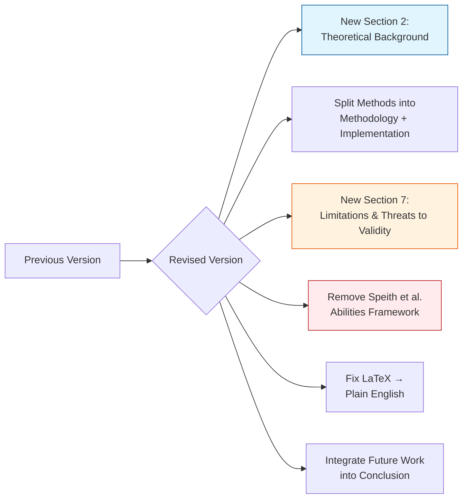
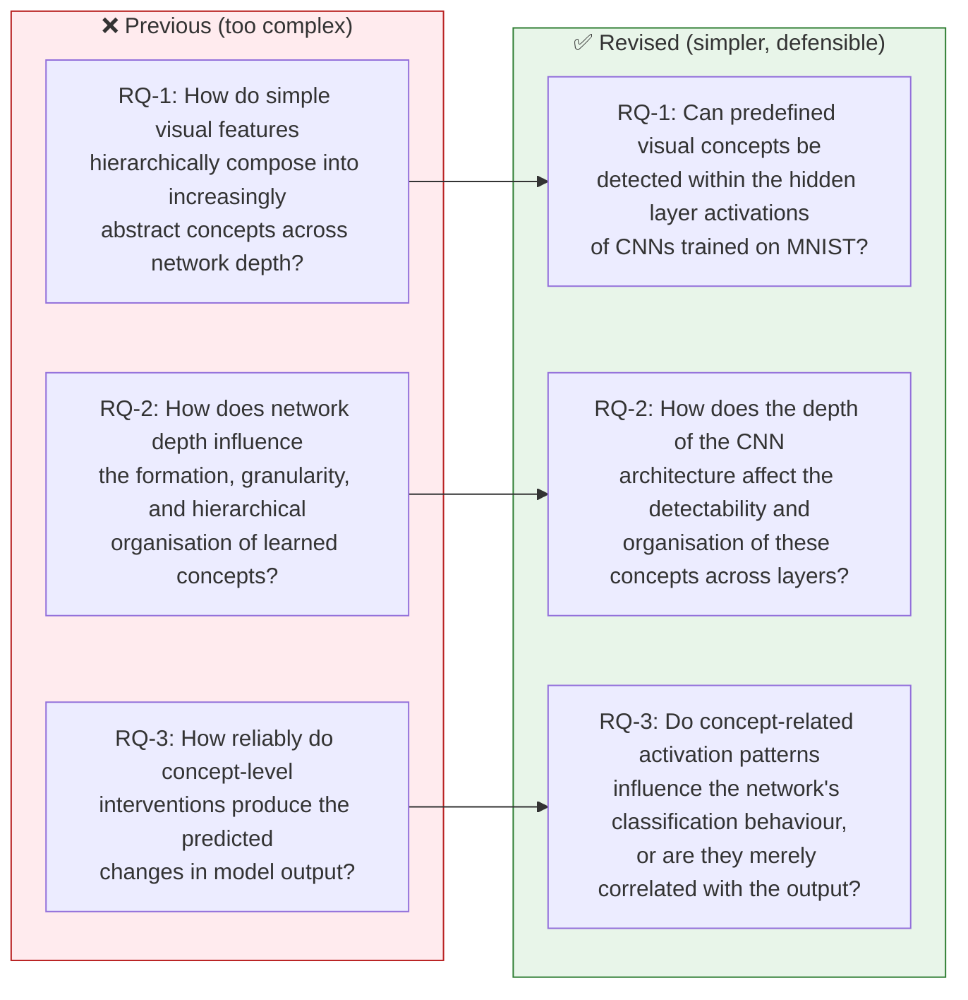

# 📋 Change Log: Revised Version vs. Previous Version

### *Specialization Module Paper — 07-MDA-13*

---

> **Subject:** Revised Version of 07-MDA-13  
> **Summary of Major Changes**

---

## 🏗️ Structural Changes

• Added a new dedicated **“Theoretical Background” section (Section 2)** that explains every technical term (CNN layers, ReLU, BatchNorm, MaxPool, CAV, TCAV, Linear Probing, RSA) before it is used in the methodology. This addresses the requirement that every concept must be explainable.

• Split the previous **“Materials and Methods”** into two sections: **“Methodology”** (what was done) and **“Implementation”** (how it was coded).

• Added a new dedicated **“Limitations and Threats to Validity” section (Section 7)** with 5 subsections (Concept Definition Bias, MNIST Simplicity, Probe Limitations, Small Experimental Scope, Causal Interpretation). Previously, limitations were only briefly mentioned in one paragraph within the Discussion.

• Removed the **“Connection to Understanding Abilities”** subsection referencing the Speith et al. abilities framework (recognising, assessing, predicting, intervening). This was too complex to defend orally and not essential to the core research questions.

• Removed all broken/incomplete LaTeX equations and replaced them with plain-English explanations and simplified inline notation.

• Integrated **“Future Work”** into the Conclusion rather than keeping it as a standalone subsection, to keep focus on completed work.

---

## ❓ Explicit Answers to Your Questions (Now Directly in the Paper)

> The following questions raised during our meeting are now explicitly answered in the revised version:

| Question | Location | Answer |
|----------|----------|--------|
| **“Where do the concepts come from?”** | Section 3.2 | *“The concepts were defined through visual inspection of MNIST digits and general knowledge of digit structure. They are human-defined concepts rather than those discovered by the network or any algorithm.”* |
| **“How are the concepts labelled?”** | Section 3.2 | Detailed explanation of class-level binary labelling with explicit positive/negative sets in Table 1, plus acknowledgment that this labelling is approximate. |
| **“What data trains the CNN?”** | Section 3.1 | *“The CNN is trained on the 60,000 MNIST training images to perform 10-class digit classification. The training labels are the digit classes (0–9). No concept labels are used during CNN training.”* |
| **“What data trains the concept classifier?”** | Section 3.5 | *“The concept classifiers are trained on the activation vectors extracted from a specific layer. The labels are the binary concept labels (positive/negative) from Table 1.”* This distinction is now clearly made. |
| **“How are activations extracted?”** | Section 3.5 | Step-by-step explanation (forward hooks → capture output tensor → global average pooling → fixed-length vector), with a concrete example (16 channels → 16-dim vector). |
| **“Why is an SVM used?”** | Section 2.3 | Full paragraph explaining hyperplane maximisation, normal vector as CAV direction, and interpretability advantage over nonlinear classifiers. |
| **“What does the CAV vector represent?”** | Section 2.3 | *“A direction in the high-dimensional space of hidden activations… not a physical component of the network.”* |
| **“What does probe accuracy actually mean?”** | Section 2.4 | *“An observational measure — it indicates detectability, not necessarily causal importance.”* |

---

## 🎯 Tone and Framing Changes

• Added **“Observation / Interpretation”** structure to every result subsection. This forces a clear separation between what the data shows and what it might mean, with explicit caveats and alternative explanations after each result.

---

## 🔬 Research Question Reframing

| Previous (too complex) | Revised (simpler, defensible) |
|------------------------|------------------------------|
| RQ-1: “How do simple visual features hierarchically compose into increasingly abstract concepts across network depth?” | **RQ-1:** “Can predefined visual concepts be detected within the hidden layer activations of CNNs trained on MNIST?” |
| RQ-2: “How does network depth influence the formation, granularity, and hierarchical organisation of learned concepts?” | **RQ-2:** “How does the depth of the CNN architecture affect the detectability and organisation of these concepts across layers?” |
| RQ-3: “How reliably do concept-level interventions produce the predicted changes in model output?” | **RQ-3:** “Do concept-related activation patterns influence the network's classification behaviour, or are they merely correlated with the output?” |

---

## ⚠️ Critical Reflection and Limitations (New Section 7)

> The following limitations are now explicitly discussed in dedicated subsections:

• **Concept Definition Bias:** Concepts are subjective, class-level labelling is approximate, another researcher might define different concepts.

• **MNIST Simplicity:** Grayscale, centred, size-normalised, only 10 classes. Concepts are simple and strongly class-correlated. Generalisation to natural images is not guaranteed.

• **Probe Limitations:** Linear probes only detect linearly separable concepts. Low accuracy ≠ concept absent; high accuracy ≠ human-like “understanding.”

• **Small Experimental Scope:** Only 3 architectures, 1 dataset, interventions only on Deep architecture, RSA sample size of 500. Results are “suggestive rather than conclusive.”

• **Causal Interpretation:** Interventions show sufficient causal relevance, not necessity. The network may have redundant encodings. The CAV is a human-constructed direction; the network may use a different one.

---

## 🤖 AI Usage Disclosure (Section 10)

• Prompts (removed the causal intervention prompt, which was too specific and not independently verifiable).

• Quantified contribution: ~40% of code, ~30% of text.

---

## 🗑️ Removed Content

• “Connection to Understanding Abilities” subsection (Speith et al. framework)

• Broken LaTeX equations and fragmented formulas

• Claims of “developing a framework” or “establishing a principled basis”

• “Future Work” as standalone subsection

---

## ➕ Added Content

• Dedicated **“Theoretical Background”** section (CNNs, XAI, TCAV, Linear Probing, RSA)

• **“Justification of each concept”** subsection explaining why each of the 5 concepts was selected

• **“Observation / Interpretation”** structure in all Results subsections

• **5 dedicated Limitations** subsections

• **Reproducibility Checklist** (10 items) in Appendix B

• **Plain-English code comments** (replaced docstring triple quotes)

---

*End of Change Log*

